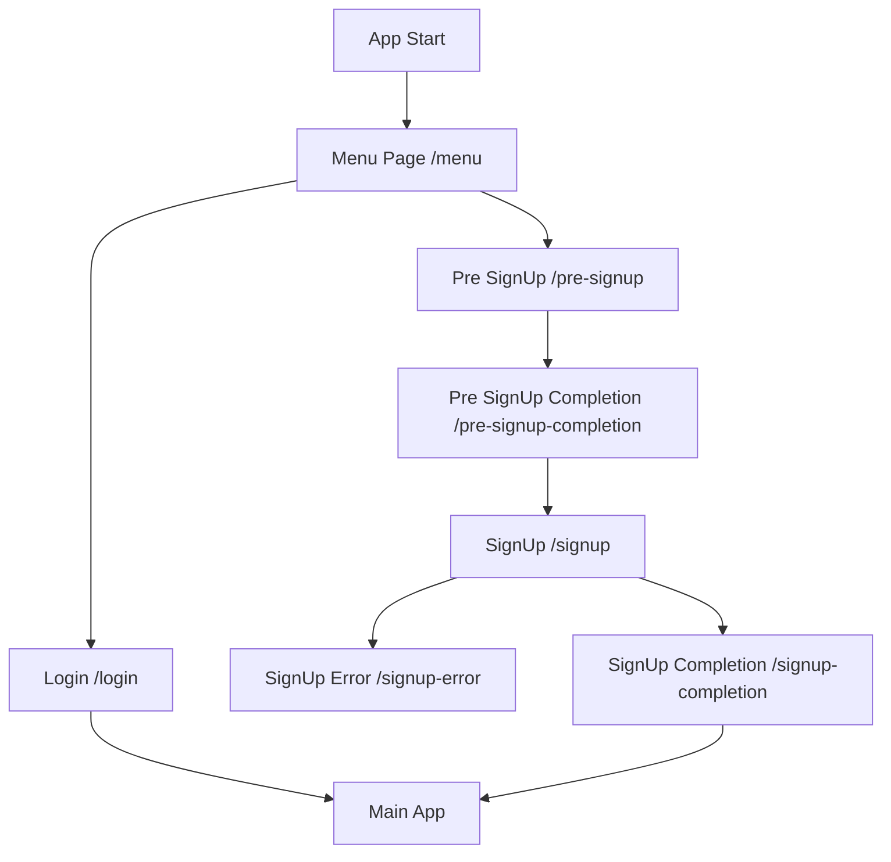
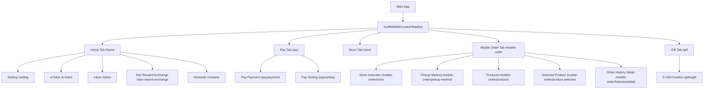
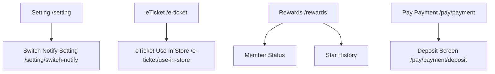
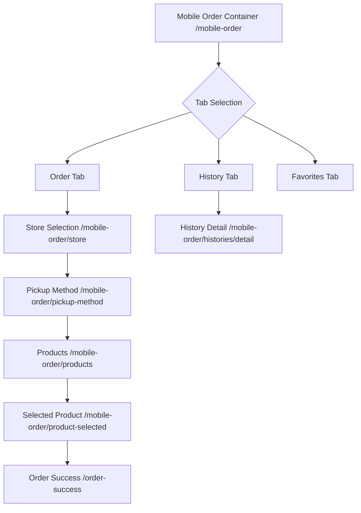
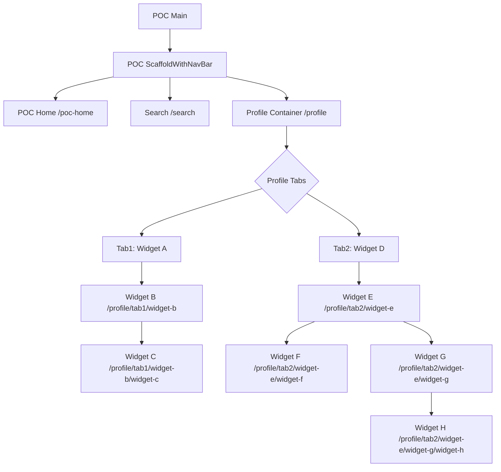
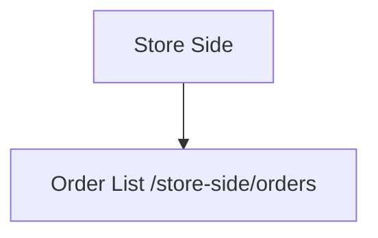

# ナビゲーションフロー図

このドキュメントは、Starbucksアプリクローンのナビゲーション構造を視覚的に示します。

## 概要

アプリは以下の主要なフローで構成されています：

1. **認証フロー**: アカウント作成・ログイン
2. **メインアプリ**: ボトムナビゲーション（5タブ）
3. **サブフロー**: 各機能の詳細画面
4. **POCセクション**: 開発・テスト用

## 詳細フロー図

### 1. 認証・初期フロー

### 2. メインアプリ（ボトムナビゲーション）

### 3. 設定・詳細フロー

### 4. モバイルオーダーフロー詳細

### 5. POC開発用フロー

### 6. 店舗側フロー

## ルート情報

### 主要ルートパス一覧

#### 認証関連
- `/menu` - メニュー画面
- `/pre-signup` - 新規会員仮登録
- `/pre-signup-completion` - 仮登録完了
- `/signup` - 新規会員登録
- `/signup-completion` - 本登録完了
- `/signup-error` - 登録失敗
- `/login` - ログイン

#### メインタブ
- `/home` - ホーム
- `/pay` - 支払い
- `/store` - 店舗
- `/mobile-order` - モバイルオーダー
- `/gift` - ギフト

#### サブフロー
- `/setting` - 設定
- `/setting/switch-notify` - 通知設定
- `/e-ticket` - eチケット
- `/e-ticket/use-in-store` - 店内利用
- `/inbox` - インボックス
- `/star-reward-exchange` - スターリワード交換
- `/rewards` - リワード
- `/pay/payment` - 支払い詳細
- `/pay/payment/deposit` - チャージ
- `/pay/setting` - 支払い設定
- `/order-success` - 注文完了
- `/gift/egift` - eギフト作成

#### モバイルオーダー関連
- `/mobile-order/store` - 店舗選択
- `/mobile-order/pickup-method` - 受取方法
- `/mobile-order/products` - 商品一覧
- `/mobile-order/product-selected` - 商品詳細
- `/mobile-order/histories/detail` - 注文履歴詳細

#### POC/開発用
- `/poc-home` - POCホーム
- `/search` - 検索
- `/profile` - プロフィールコンテナ
- `/profile/tab1/widget-b` - Widget B
- `/profile/tab1/widget-b/widget-c` - Widget C
- `/profile/tab2/widget-e` - Widget E
- `/profile/tab2/widget-e/widget-f` - Widget F
- `/profile/tab2/widget-e/widget-g` - Widget G
- `/profile/tab2/widget-e/widget-g/widget-h` - Widget H

#### 店舗側
- `/store-side/orders` - 注文一覧

## 特徴

### ナビゲーション構造
- **StatefulShellRoute.indexedStack**: メインアプリとPOCセクションで使用
- **ネストルート**: モバイルオーダーとPOCプロフィールで階層構造
- **カスタムトランジション**: 右から左、下から上のスライドアニメーション

### 状態管理
- タブインデックスをクエリパラメータで管理
- `extra`パラメータでデータ受け渡し
- ナビゲーション状態の永続化（StatefulShellRoute）

### パラメータ処理
- クエリパラメータ: `?tab=0`, `?data=value`
- Extraオブジェクト: 複雑なデータの受け渡し
- 型安全なパラメータ解析

## 注意事項

- メインアプリとPOCセクションは独立したナビゲーション構造
- 一部のルートはコメントアウトされており、将来の機能拡張に備えている
- アニメーション付きルートは`pageBuilder`を使用
- 通常のルートは`builder`を使用

このフロー図は`lib/config/app_router.dart`の実装に基づいて作成されています。