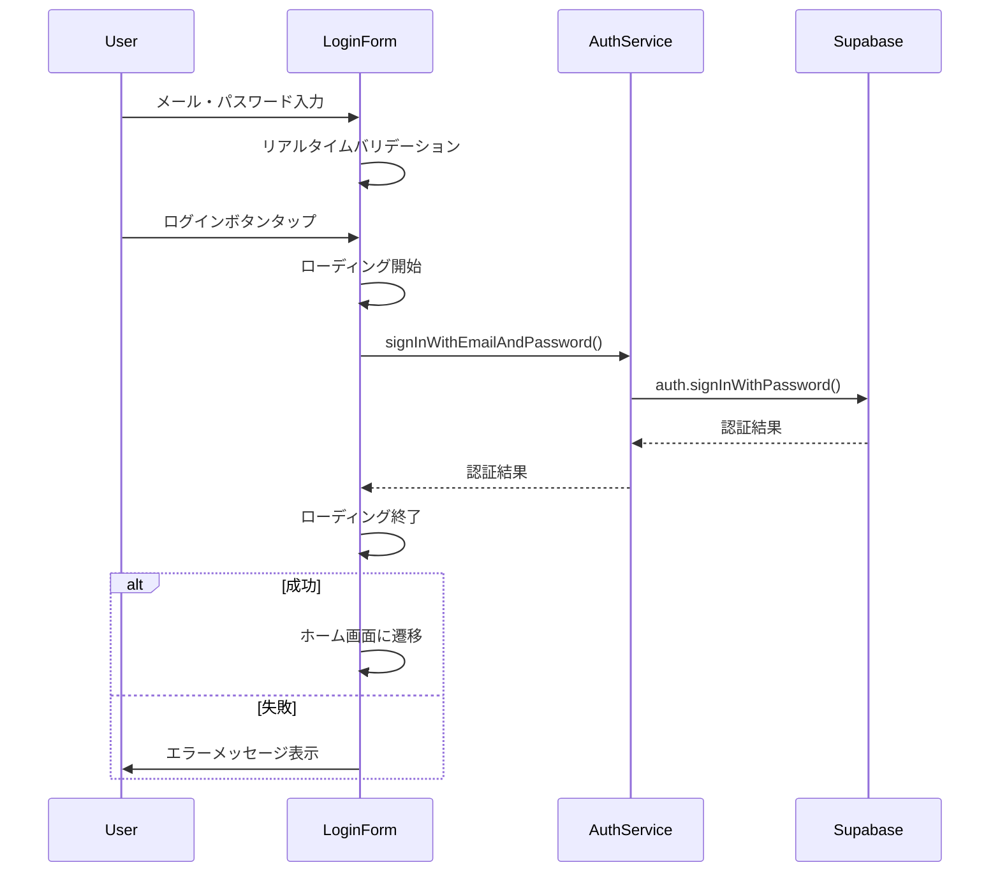
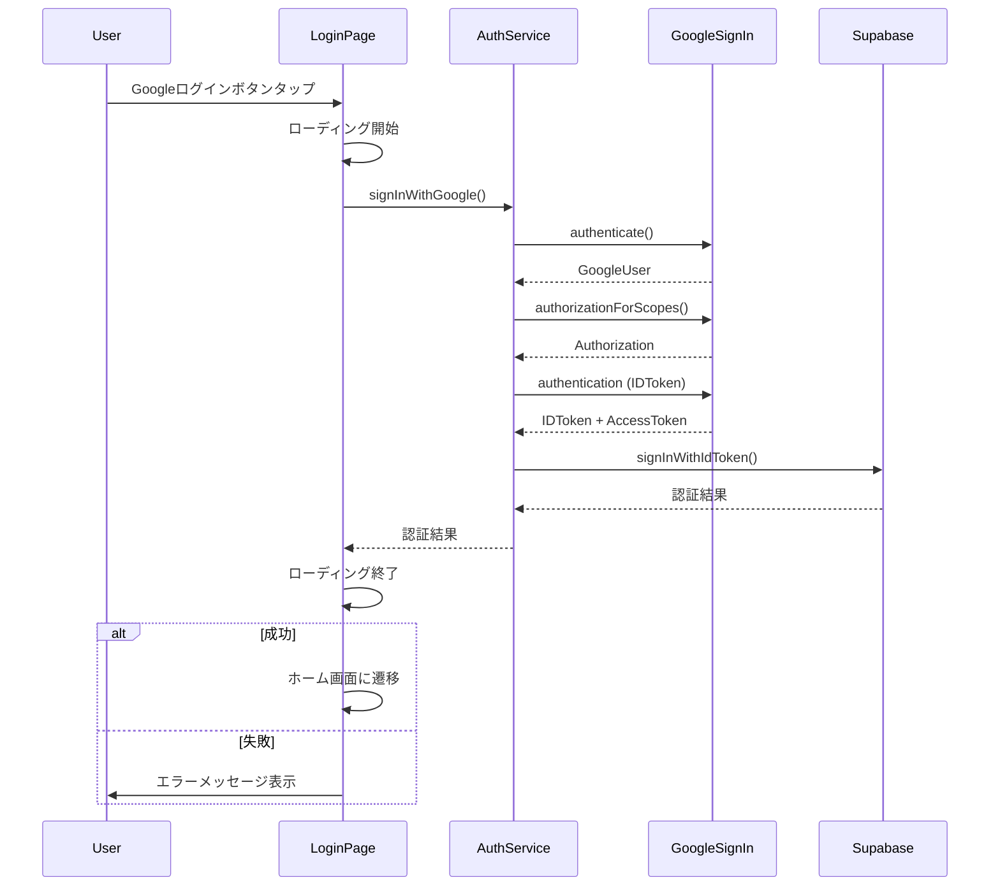

# ログイン機能 認証フロー仕様書

## 1. 認証フロー概要

### 1.1 サポートする認証方式

1. **メールアドレス・パスワード認証** (Supabase)
2. **Googleアカウント認証** (Google Sign-In + Supabase)
3. **生体認証** (実装準備済み、コメントアウト状態)

### 1.2 認証プロバイダー

- **プライマリ**: Supabase Auth
- **OAuth**: Google Sign-In
- **依存性注入**: GetIt

## 2. 認証状態管理

### 2.1 AuthStateの監視

```dart
StreamSubscription<AuthState>? _authStateSubscription;

void _setupAuthStateListener() {
  _authStateSubscription = _supabase.auth.onAuthStateChange.listen((data) {
    final event = data.event;
    final session = data.session;
    _handleAuthStateChange(event, session);
  });
}
```

### 2.2 認証状態イベント

| イベント | 処理内容 |
|---------|---------|
| `initialSession` | 初回セッション確立時の状態設定 |
| `signedIn` | ログイン成功時の処理 |
| `signedOut` | ログアウト時の状態クリア |
| `passwordRecovery` | パスワード回復処理 |
| `tokenRefreshed` | トークン更新時の処理 |
| `userUpdated` | ユーザー情報更新時の処理 |
| `userDeleted` | ユーザー削除時の処理 |

## 3. メール・パスワード認証フロー

### 3.1 認証プロセス



### 3.2 実装詳細

```dart
Future<void> _handleAuthenticationByEmailAndPassword() async {
  FocusScope.of(context).unfocus(); // キーボードを閉じる
  widget.onLoadingStateChanged(true);

  try {
    final String? userData = await widget.authService.retrieveLoginUser();
    
    if (userData != null) {
      // 既にログイン済みの場合はログアウト
      await widget.authService.signOutWithEmailAndPassword();
      widget.showSnackBar('サインアウトしました。');
    } else {
      // ログイン処理
      await widget.authService.signInWithEmailAndPassword(
        _emailController.text,
        _passwordController.text,
      );
    }
    
    widget.onLoginSuccess();
    widget.onLoadingStateChanged(false);
    
  } on PlatformException catch (e) {
    widget.onLoadingStateChanged(false);
    widget.showSnackBar('認証処理に失敗しました(メールアドレス)');
  } catch (err) {
    widget.onLoadingStateChanged(false);
    widget.showSnackBar('$err:認証処理に失敗(メールアドレス)');
  }
}
```

### 3.3 AuthServiceでの処理

```dart
Future<void> signInWithEmailAndPassword(String email, String password) async {
  try {
    await supabase.auth.signInWithPassword(email: email, password: password);
  } catch (error) {
    rethrow;
  }
}
```

## 4. Google認証フロー

### 4.1 認証プロセス



### 4.2 Google認証の実装詳細

#### 4.2.1 スコープ設定

```dart
const List<String> scopes = <String>[
  'https://www.googleapis.com/auth/userinfo.email',
  'https://www.googleapis.com/auth/userinfo.profile',
  'openid',
];
```

#### 4.2.2 認証処理

```dart
Future<void> signInWithGoogle() async {
  // Step 1: ユーザー認証
  final googleUser = await _googleSignIn.authenticate();
  
  // Step 2: スコープ認可
  var authorization = await googleUser.authorizationClient.authorizationForScopes(scopes);
  
  if (authorization == null) {
    final authorizeResult = await googleUser.authorizationClient.authorizeScopes(scopes);
    authorization = authorizeResult;
  }
  
  // Step 3: トークン取得
  final googleAuth = googleUser.authentication;
  final idToken = googleAuth.idToken;
  final accessToken = authorization.accessToken;
  
  // Step 4: Supabaseでサインイン
  await supabase.auth.signInWithIdToken(
    provider: OAuthProvider.google,
    idToken: idToken,
    accessToken: accessToken,
  );
}
```

### 4.3 軽量認証（初期化時）

```dart
Future<void> initializeGoogleSignIn() async {
  if (isAuthenticated()) return;
  
  final googleUser = await _googleSignIn.attemptLightweightAuthentication();
  if (googleUser != null) {
    await _performAuthentication();
  }
}
```

## 5. 生体認証フロー（準備済み）

### 5.1 準備されている実装

```dart
// コメントアウト状態の生体認証コード
Future<void> _authenticateWithBiometrics() async {
  bool authenticated = false;
  try {
    setState(() {
      _isAuthenticating = true;
      _authorized = 'Authenticating';
    });
    
    // authenticated = await auth.authenticate(
    //   localizedReason: '指紋認証を行ってください',
    //   options: const AuthenticationOptions(stickyAuth: true, biometricOnly: true),
    // );
    
    if (authenticated && mounted) {
      _navigateToHome();
    }
  } on PlatformException catch (e) {
    // エラーハンドリング
  }
}
```

### 5.2 生体認証チェック機能

```dart
Future<void> _getAvailableBiometrics() async {
  try {
    // availableBiometrics = await auth.getAvailableBiometrics();
  } on PlatformException catch (e) {
    print(e);
  }
}
```

## 6. セッション管理

### 6.1 現在のユーザー取得

```dart
Future<String?> retrieveLoginUser() async {
  try {
    final User? user = supabase.auth.currentUser;
    return user?.email;
  } catch (error) {
    rethrow;
  }
}
```

### 6.2 認証状態チェック

```dart
bool isAuthenticated() {
  return supabase.auth.currentUser != null;
}
```

### 6.3 ユーザーID取得

```dart
String getUserId() {
  final userId = supabase.auth.currentUser?.id;
  if (userId == null) {
    throw Exception('ユーザーが認証されていません');
  }
  return userId;
}
```

## 7. トークン管理

### 7.1 FCMトークン設定

```dart
Future<void> setFcmTokenAndNotifySetting(String fcmToken, bool isNotify) async {
  final userId = supabase.auth.currentUser!.id;
  final status = isNotify ? 1 : 0;
  
  await supabase.from(Tables.userFcmTokens).upsert({
    'user_id': userId,
    'fcm_token': fcmToken,
    'is_notify': status,
  });
}
```

### 7.2 トークンリフレッシュ

```dart
FirebaseMessaging.instance.onTokenRefresh.listen((fcmToken) async {
  await _authService.setFcmTokenAndNotifySetting(fcmToken, true);
});
```

## 8. ログアウトフロー

### 8.1 メール・パスワード認証のログアウト

```dart
Future<void> signOutWithEmailAndPassword() async {
  try {
    await supabase.auth.signOut();
  } catch (error) {
    rethrow;
  }
}
```

### 8.2 Google認証のログアウト

```dart
Future<void> signOutWithGoogle() async {
  try {
    await supabase.auth.signOut();  // Supabaseからログアウト
    await _googleSignIn.signOut();  // Googleからログアウト
  } catch (error) {
    rethrow;
  }
}
```

## 9. 初期化フロー

### 9.1 initState処理

```dart
@override
void initState() {
  super.initState();
  _setupAuthStateListener();      // 認証状態監視開始
  _getAvailableBiometrics();      // 生体認証チェック
  _initializeAndNavigate();       // 初期化と自動ナビゲーション
}
```

### 9.2 自動認証チェック

```dart
Future<void> _initializeAndNavigate() async {
  try {
    await _authService.initializeGoogleSignIn();
    if (_authService.isAuthenticated()) {
      _navigateToHome();  // 既に認証済みの場合は自動遷移
    }
  } catch (e) {
    // エラー処理（ログイン画面に留まる）
  }
}
```

## 10. エラーハンドリング

### 10.1 プラットフォーム例外

```dart
try {
  // 認証処理
} on PlatformException catch (e) {
  widget.onLoadingStateChanged(false);
  widget.showSnackBar('認証処理に失敗しました(PlatformException)');
} catch (err) {
  widget.onLoadingStateChanged(false);
  widget.showSnackBar('$err:認証処理に失敗しました(OtherException)');
}
```

### 10.2 マウント状態チェック

```dart
if (!mounted) return;  // Widgetが破棄されている場合は処理を中断

void _navigateToHome() {
  if (mounted) {
    context.go(Home.routeName);
  }
}
```

## 11. セキュリティ考慮事項

### 11.1 トークン管理
- IDトークンとアクセストークンの適切な取り扱い
- トークンの有効期限管理
- 自動リフレッシュ機能

### 11.2 プラットフォームセキュリティ
- Google Sign-InのOAuth 2.0準拠
- Supabaseによるセキュアな認証基盤
- 生体認証の準備（将来的な実装）

### 11.3 エラー情報の適切な処理
- デバッグモード時のみエラー詳細出力
- ユーザーに対する適切なエラーメッセージ表示