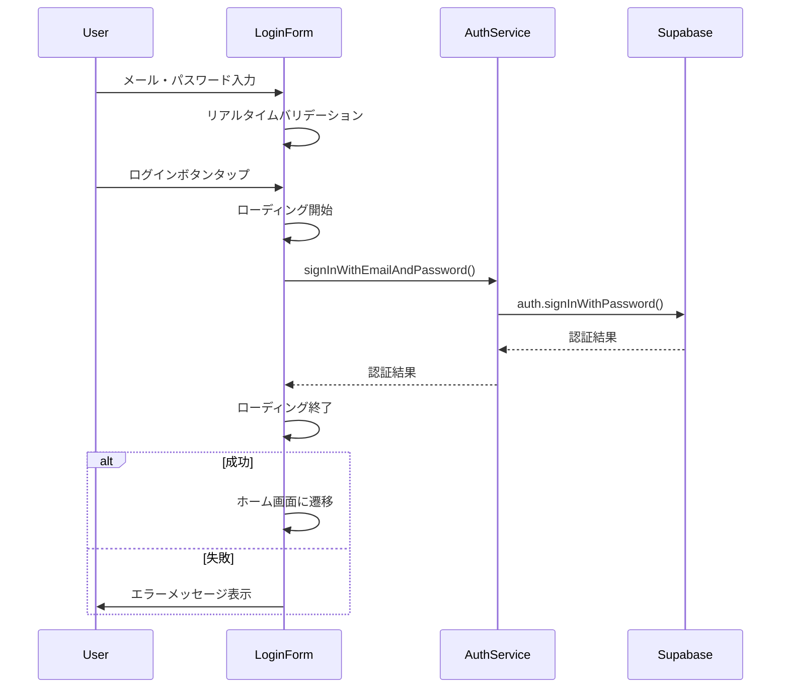
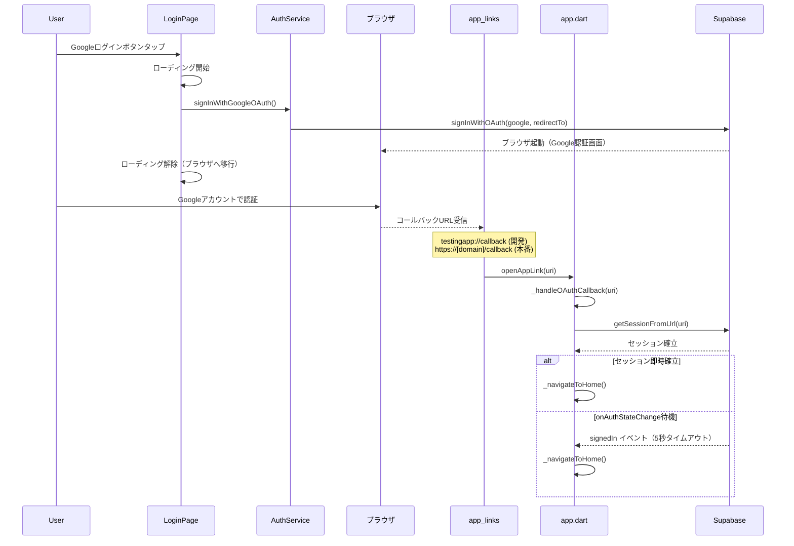

# ログイン機能 認証フロー仕様書

## 1. 認証フロー概要

### 1.1 サポートする認証方式

1. **メールアドレス・パスワード認証** (Supabase)
2. **Googleアカウント認証** (Supabase OAuth)
3. **生体認証** (実装済み)

### 1.2 認証プロバイダー

- **プライマリ**: Supabase Auth
- **OAuth**: Supabase OAuth（ブラウザ経由）
- **ディープリンク**: app_links
- **依存性注入**: GetIt

## 2. 認証状態管理

### 2.1 AuthStateの監視

```dart
StreamSubscription<AuthState>? _authStateSubscription;

void _setupAuthStateListener() {
  _authStateSubscription = _supabase.auth.onAuthStateChange.listen((data) {
    final event = data.event;
    final session = data.session;
    _handleAuthStateChange(event, session);
  });
}
```

### 2.2 認証状態イベント

| イベント | 処理内容 |
|---------|---------|
| `initialSession` | 初回セッション確立時の状態設定 |
| `signedIn` | ログイン成功時の処理 |
| `signedOut` | ログアウト時の状態クリア |
| `passwordRecovery` | パスワード回復処理 |
| `tokenRefreshed` | トークン更新時の処理 |
| `userUpdated` | ユーザー情報更新時の処理 |
| `userDeleted` | ユーザー削除時の処理 |

## 3. メール・パスワード認証フロー

### 3.1 認証プロセス



### 3.2 実装詳細

```dart
Future<void> _handleAuthenticationByEmailAndPassword() async {
  FocusScope.of(context).unfocus(); // キーボードを閉じる
  widget.onLoadingStateChanged(true);

  try {
    final String? userData = await widget.authService.retrieveLoginUser();
    
    if (userData != null) {
      // 既にログイン済みの場合はログアウト
      await widget.authService.signOutWithEmailAndPassword();
      widget.showSnackBar('サインアウトしました。');
    } else {
      // ログイン処理
      await widget.authService.signInWithEmailAndPassword(
        _emailController.text,
        _passwordController.text,
      );
    }
    
    widget.onLoginSuccess();
    widget.onLoadingStateChanged(false);
    
  } on PlatformException catch (e) {
    widget.onLoadingStateChanged(false);
    widget.showSnackBar('認証処理に失敗しました(メールアドレス)');
  } catch (err) {
    widget.onLoadingStateChanged(false);
    widget.showSnackBar('$err:認証処理に失敗(メールアドレス)');
  }
}
```

### 3.3 AuthServiceでの処理

```dart
Future<void> signInWithEmailAndPassword(String email, String password) async {
  try {
    await supabase.auth.signInWithPassword(email: email, password: password);
  } catch (error) {
    rethrow;
  }
}
```

## 4. Google認証フロー

### 4.1 認証プロセス



### 4.2 Google認証の実装詳細

#### 4.2.1 サインイン処理（AuthService）

```dart
/// Google OAuth でサインイン（Supabase Auth 経由）
Future<void> signInWithGoogleOAuth() async {
  final redirectTo = kDebugMode
      ? 'testingapp://callback'
      : 'https://${AppConstants.firebaseHostingDomain}/callback';
  await supabase.auth.signInWithOAuth(OAuthProvider.google, redirectTo: redirectTo);
}
```

#### 4.2.2 GoogleLoginButton でのハンドリング

```dart
Future<void> _handleAuthenticationByGoogle(BuildContext context) async {
  onLoadingStateChanged(true);
  try {
    if (email != null) {
      await authService.signOutWithEmailAndPassword();
      showSnackBar('サインアウトしました。');
    } else {
      // ブラウザを開いて Google OAuth 認証（コールバックは app.dart で処理）
      await authService.signInWithGoogleOAuth();
      // ブラウザが開いたのでローディングを解除（認証完了はディープリンクで処理）
      if (context.mounted) {
        onLoadingStateChanged(false);
      }
      return;
    }
  } on PlatformException catch (e) {
    if (context.mounted) {
      onLoadingStateChanged(false);
    }
    showSnackBar('認証処理に失敗しました(PlatformException)');
  } catch (err) {
    if (context.mounted) {
      onLoadingStateChanged(false);
    }
    showSnackBar('$err:認証処理に失敗しました(OtherException)');
  }
}
```

#### 4.2.3 OAuthコールバック処理（app.dart）

```dart
/// OAuth コールバックを処理してHome画面へ遷移
Future<void> _handleOAuthCallback(Uri uri) async {
  try {
    // supabase_flutter の内部リスナーが先に処理している場合は例外が出るが無視する
    await Supabase.instance.client.auth.getSessionFromUrl(uri);
  } catch (e) {
    // エラーは無視（内部リスナーが処理済みの場合）
  }

  // セッションが即時確立された場合はホームへ遷移
  final session = Supabase.instance.client.auth.currentSession;
  if (session != null) {
    _navigateToHome();
  } else {
    // セッションがまだ反映されていない場合は onAuthStateChange を一度だけ待つ
    final completer = Completer<bool>();
    final subscription = Supabase.instance.client.auth.onAuthStateChange.listen((data) {
      if (!completer.isCompleted &&
          (data.event == AuthChangeEvent.signedIn ||
              data.event == AuthChangeEvent.tokenRefreshed)) {
        completer.complete(true);
      }
    });
    final signedIn = await completer.future.timeout(
      const Duration(seconds: 5),
      onTimeout: () => false,
    );
    await subscription.cancel();
    if (signedIn) {
      _navigateToHome();
    } else {
      LoggerService.warn('OAuth session が存在しません');
    }
  }
}
```

## 5. 生体認証フロー（準備済み）

### 5.1 準備されている実装

```dart
// コメントアウト状態の生体認証コード
Future<void> _authenticateWithBiometrics() async {
  bool authenticated = false;
  try {
    setState(() {
      _isAuthenticating = true;
      _authorized = 'Authenticating';
    });
    
    // authenticated = await auth.authenticate(
    //   localizedReason: '指紋認証を行ってください',
    //   options: const AuthenticationOptions(stickyAuth: true, biometricOnly: true),
    // );
    
    if (authenticated && mounted) {
      _navigateToHome();
    }
  } on PlatformException catch (e) {
    // エラーハンドリング
  }
}
```

### 5.2 生体認証チェック機能

```dart
Future<void> _getAvailableBiometrics() async {
  try {
    // availableBiometrics = await auth.getAvailableBiometrics();
  } on PlatformException catch (e) {
    print(e);
  }
}
```

## 6. セッション管理

### 6.1 現在のユーザー取得

```dart
Future<String?> retrieveLoginUser() async {
  try {
    final User? user = supabase.auth.currentUser;
    return user?.email;
  } catch (error) {
    rethrow;
  }
}
```

### 6.2 認証状態チェック

```dart
bool isAuthenticated() {
  return supabase.auth.currentUser != null;
}
```

### 6.3 ユーザーID取得

```dart
String getUserId() {
  final userId = supabase.auth.currentUser?.id;
  if (userId == null) {
    throw Exception('ユーザーが認証されていません');
  }
  return userId;
}
```

## 7. トークン管理

### 7.1 FCMトークン設定

```dart
Future<void> setFcmTokenAndNotifySetting(
  String fcmToken,
  bool isNotify, {
  required String deviceId,
  String? deviceName,
}) async {
  final userId = supabase.auth.currentUser?.id;
  if (userId == null) {
    LoggerService.warn('FCMトークン登録: ユーザーが未ログインのためスキップ');
    return;
  }
  final status = isNotify ? 1 : 0;
  await supabase.from(Tables.userFcmTokens).upsert({
    'user_id': userId,
    'device_id': deviceId,
    'device_name': deviceName,
    'fcm_token': fcmToken,
    'is_notify': status,
  }, onConflict: 'user_id,device_id');
}
```

### 7.2 トークンリフレッシュ

```dart
FirebaseMessaging.instance.onTokenRefresh.listen((fcmToken) async {
  final deviceId = await DeviceIdService().getDeviceId();
  final deviceName = await DeviceIdService().getDeviceName();
  await _authService.setFcmTokenAndNotifySetting(
    fcmToken,
    true,
    deviceId: deviceId,
    deviceName: deviceName,
  );
});
```

## 8. ログアウトフロー

### 8.1 ログアウト処理（統一）

メール・パスワード認証とGoogle認証のログアウトは `signOutWithEmailAndPassword()` に統一されています。

```dart
Future<void> signOutWithEmailAndPassword() async {
  try {
    // サインアウト前にCrashlyticsのユーザー識別子をクリア
    await _clearCrashlyticsUser();

    await supabase.auth.signOut();
  } catch (error) {
    rethrow;
  }
}
```

### 8.2 デバイスFCMトークン付きログアウト

```dart
Future<void> signOutWithEmailAndPasswordAndDevice(String deviceId) async {
  await removeFcmToken(deviceId);
  await signOutWithEmailAndPassword();
}
```

## 9. 初期化フロー

### 9.1 initState処理

```dart
@override
void initState() {
  super.initState();
  _setupAuthStateListener();      // 認証状態監視開始
  _initializeBiometricAuth();     // 生体認証の初期化と自動ログイン判定
}
```

### 9.2 自動認証チェック

```dart
Future<void> _initializeBiometricAuth() async {
  // 生体認証の可用性を確認
  bool canCheckBiometrics = await auth.canCheckBiometrics;
  final isDeviceSupported = await auth.isDeviceSupported();
  canCheckBiometrics = canCheckBiometrics && isDeviceSupported;

  // 生体認証が利用可能かつ有効化・認証情報が保存済みの場合は自動ログイン
  final biometricEnabled = await _isBiometricEnabled();
  final hasStoredCredentials = await _hasStoredCredentials();

  if (canCheckBiometrics && biometricEnabled && hasStoredCredentials) {
    await _authenticateWithBiometrics();
  }
}
```

なお、Google OAuth認証のコールバックは `app.dart` の `_handleOAuthCallback()` で処理され、
ログイン画面は `isAuthenticated()` のポーリングを行いません。
Supabaseセッションは `onAuthStateChange` イベントで自動的に管理されます。

## 10. エラーハンドリング

### 10.1 プラットフォーム例外

```dart
try {
  // 認証処理
} on PlatformException catch (e) {
  widget.onLoadingStateChanged(false);
  widget.showSnackBar('認証処理に失敗しました(PlatformException)');
} catch (err) {
  widget.onLoadingStateChanged(false);
  widget.showSnackBar('$err:認証処理に失敗しました(OtherException)');
}
```

### 10.2 マウント状態チェック

```dart
if (!mounted) return;  // Widgetが破棄されている場合は処理を中断

void _navigateToHome() {
  if (mounted) {
    context.go(Home.routeName);
  }
}
```

## 11. セキュリティ考慮事項

### 11.1 トークン管理
- IDトークンとアクセストークンの適切な取り扱い
- トークンの有効期限管理
- 自動リフレッシュ機能

### 11.2 プラットフォームセキュリティ
- Supabase OAuth 2.0準拠のGoogle認証
- Supabaseによるセキュアな認証基盤
- 生体認証（local_auth）による自動ログイン
- OAuthコールバックURI検証（スキーム・ホスト）

### 11.3 エラー情報の適切な処理
- デバッグモード時のみエラー詳細出力
- ユーザーに対する適切なエラーメッセージ表示