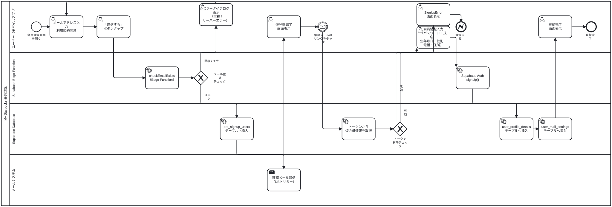

# 会員登録フロー（BPMN図）

仮登録（メールアドレス入力 → 確認メール送信）と本登録（ディープリンク経由）の2段階フロー。

## 登場するシステム

| レーン | 役割 |
|---|---|
| ユーザー（モバイルアプリ） | メール入力・ボタン操作・画面遷移 |
| Supabase Edge Function | `checkEmailExists` でメール重複チェック、`auth.signUp()` |
| Supabase Database | `pre_signup_users` / `user_profile_details` / `user_mail_settings` への書き込み |
| メールシステム | DBトリガー経由で確認メール送信 |

## BPMN図の更新方法

1. `docs/bpmn/` で `npm start` を実行
2. `http://localhost:9013` のヘッダー右上「**SVGをダウンロード**」をクリック
3. ダウンロードされた `user_signup_flow.svg` を `docs/zensical-docs/docs/starbucks_user_side/signup_pre/images/` に上書き配置
