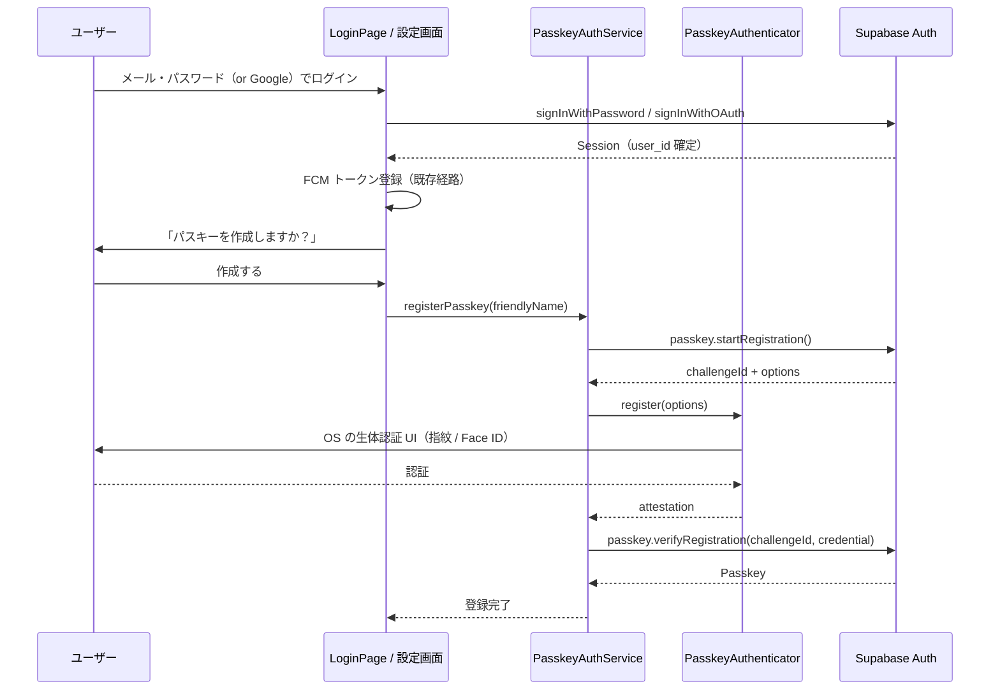
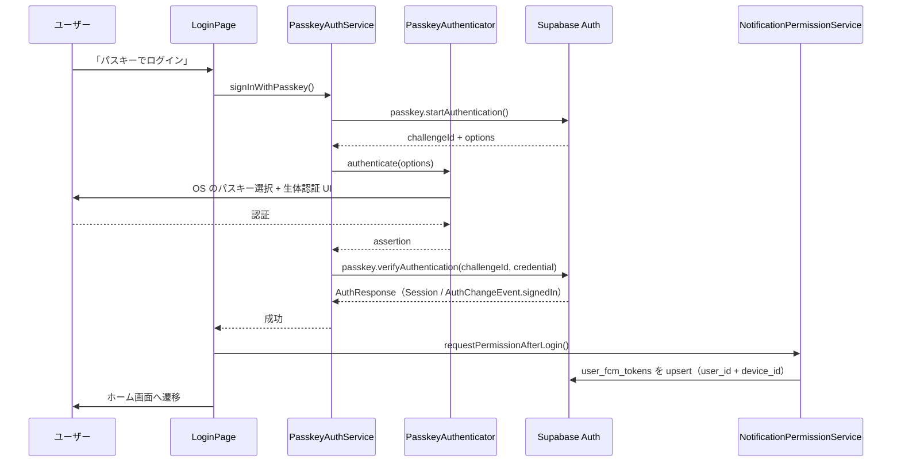

# パスキー導入 設計書（ログイン認証フロー刷新）

関連 Issue: [#807 認証関係のIssue](https://github.com/eno-conan/flutter-starbucks-clone/issues/807) / [#697 パスキー実装について](https://github.com/eno-conan/flutter-starbucks-clone/issues/697)

影響度ティア: **critical**（`lib/services/**`・`pubspec.yaml`・`android/**`・`ios/**` を含む）
→ 計画=Opus / 実装=Sonnet / 必須レビュー=code-reviewer + qa-agent + security-agent

---

## 1. 背景と目的

### 1.1 現状のログイン体験

現在のログイン画面（`lib/screens/starbucks_user_side/signin/login.dart`）は、以下の流れになっている。

```
初回:   メールアドレス・パスワード（または Google）でログイン
          ↓
        「指紋認証を有効にしますか？」ダイアログ
          ↓
        secure storage に認証情報を保存

2回目:  ログイン画面を開くと自動的に指紋認証 UI が起動
          ↓
        指紋認証成功 → secure storage から認証情報を読み出す
          ↓
        signInWithPassword(email, password) を再実行してセッション取得
```

### 1.2 現状の問題点

| # | 問題 | 詳細 |
|---|---|---|
| 1 | **パスワードを端末に平文 JSON で保存している** | `_storeCredentials()` が `type` / `email` / `password` を JSON 化して `FlutterSecureStorage` に保存している。暗号化ストレージとはいえ、パスワード原本を端末に置くのは OWASP Mobile M9（安全でないデータストレージ）/ M1（不適切な認証情報の使用）に抵触する |
| 2 | **指紋認証がサーバ側の認証になっていない** | `local_auth` の成功は「端末のロックが解除できた」ことしか証明しない。実際のサーバ認証は保存済みパスワードの再送であり、フィッシング耐性はゼロ |
| 3 | **Google ログインは自動ログインできない** | `_performBiometricLogin()` の `type == 'google'` 分岐は `refreshSession()` を試みるだけで、セッション切れ時は「再度Googleログインが必要です」で終わる |
| 4 | **ログイン画面のロジックが 941 行の StatefulWidget に集中** | 認証・secure storage・FCM・UI が同一クラスに混在し、テスト・レビューが困難 |

### 1.3 本設計のゴール

- 指紋（生体）認証を **パスキー（WebAuthn）による本物のサーバ認証** に置き換える
- 端末からパスワード原本を排除する
- **FCM トークン登録・プッシュ通知を一切壊さない**（本設計の最重要制約）
- 既存のメール・パスワード / Google ログインはフォールバックとして残す

---

## 2. 方式選定

### 2.1 結論: Supabase ネイティブ Passkey を採用する

Issue #697 の PoC では Corbado（`corbado_auth`）を検証していたが、**本実装では採用しない。**

| 観点 | Supabase ネイティブ Passkey | Corbado |
|---|---|---|
| ユーザー ID の連続性 | `auth.users.id` がそのまま維持される | Corbado 側に別 ID 体系ができ、Supabase の `user_id` と二重管理になる |
| **FCM トークンへの影響** | **なし**（`user_fcm_tokens.user_id` は不変） | **致命的**（`user_id` が変わると既存トークン行が全て孤児化する） |
| RLS / 既存テーブル | そのまま使える | JWT の発行元が変わるため RLS を全面見直し |
| 追加依存 | `passkeys` プラグインのみ | `corbado_auth` + Corbado アカウント運用 |
| 費用 | Supabase に内包 | 外部 SaaS の従量課金 |

ユーザーからの最重要要件が「FCM トークンがこれまで通り機能すること」である以上、**認証プロバイダを Supabase から動かさない選択肢しかない。** Issue #697 の最終コメント「これは単体で別プロジェクト立ち上げた方がいいかも」とも整合する（Corbado 検証は別プロジェクトへ）。

### 2.2 利用可能なことの確認（2026-08 時点、ソース確認済み）

Supabase Auth のパスキーは 2026-05-28 に **Beta** で提供開始された。Flutter クライアントは `supabase_flutter` **2.15.0 以降**で利用でき、本リポジトリの `pubspec.yaml` は既に `supabase_flutter: ^2.17.1` を指定しているため、**依存追加なしでサーバ側 API は使える。**

確認したソース: `supabase-flutter` リポジトリ `packages/supabase_flutter/lib/src/supabase_passkey.dart`

```dart
@experimental
extension AuthClientPasskey on AuthClient {
  /// サインイン済みユーザーに新しいパスキーを登録する
  Future<Passkey> registerPasskey(
    PasskeyAuthenticatorInterface authenticator, {
    String? friendlyName,
  });

  /// パスキーでサインインする（既存セッション不要）
  Future<AuthResponse> signInWithPasskey(
    PasskeyAuthenticatorInterface authenticator, {
    String? captchaToken,
  });
}
```

低レベル API（`supabase.auth.passkey`）:

| メソッド | 用途 |
|---|---|
| `startRegistration({String? friendlyName})` | 登録チャレンジ取得 |
| `verifyRegistration({required String challengeId, required Map<String, dynamic> credential})` | 登録検証 |
| `startAuthentication({String? captchaToken})` | 認証チャレンジ取得 |
| `verifyAuthentication({required String challengeId, required Map<String, dynamic> credential})` | 認証検証 → `AuthResponse` |
| `list()` | 登録済みパスキー一覧 |
| `update({required String passkeyId, required String friendlyName})` | 表示名変更 |
| `delete({required String passkeyId})` | 削除 |

`supabase_flutter` は端末側の WebAuthn セレモニーを **自前で実装していない**。`PasskeyAuthenticatorInterface` の実装を呼び出し側が渡す設計になっているため、`passkeys` プラグインを追加する。

```yaml
# pubspec.yaml に追加
passkeys: ^2.22.3   # PasskeyAuthenticator implements PasskeyAuthenticatorInterface（2.21.0 以降）
```

確認したソース: `corbado/flutter-passkeys` リポジトリ `packages/passkeys/passkeys/lib/authenticator.dart`
（`class PasskeyAuthenticator implements PasskeyAuthenticatorInterface`）

> 注: `supabase_flutter` 2.17.1 時点では拡張の宣言が `extension GoTrueClientPasskey on GoTrueClient` になっている（`main` ブランチでは `AuthClient` へリネーム済み）。いずれも呼び出し側は `supabase.auth.signInWithPasskey(...)` で変わらないが、実装時にインストール済みバージョンのソースで最終確認すること。

### 2.3 重要な仕様上の前提

- **パスキーは「既存ユーザーに追加する認証手段」**であり、パスキー単体で新規ユーザーを作ることはできない。`registerPasskey()` はサインイン済み（非匿名）ユーザーを要求する。
  → **この仕様が本設計の安全性を担保している。** ユーザーは必ず既存の `auth.users.id` を持ったままパスキーを追加するため、`user_id` が変化することはない。
- サインインは **discoverable credentials（Resident Key）** を使う。ユーザーはメールアドレスを入力せず、OS のパスキー選択 UI から直接ログインできる。
- Supabase 側で「Enable Passkey authentication」を有効化する必要がある（既定は無効）。

---

## 3. 導入後の認証フロー

### 3.1 全体像

```
┌─ 初回（パスキー未登録） ────────────────────────────────┐
│ メール・パスワード or Google でログイン                  │
│   ↓ セッション確立（user_id 確定）                       │
│ FCM トークン登録                                        │
│   ↓                                                     │
│ 「パスキーを作成しますか？」ダイアログ                   │
│   ↓ はい                                                │
│ registerPasskey() → OS の生体認証 UI → 端末に鍵を生成    │
└────────────────────────────────────────────────────────┘

┌─ 2回目以降（パスキー登録済み・セッション切れ） ──────────┐
│ ログイン画面を開く                                       │
│   ↓ パスキーが使える端末か判定                           │
│ 「パスキーでログイン」ボタン（自動起動はしない）          │
│   ↓                                                     │
│ signInWithPasskey() → OS の生体認証 UI                   │
│   ↓ 成功 = サーバ側で署名検証 → セッション確立            │
│ FCM トークン登録（既存と同じ経路）→ ホーム画面            │
└────────────────────────────────────────────────────────┘

┌─ フォールバック ───────────────────────────────────────┐
│ パスキー非対応端末 / 登録なし / ユーザーがキャンセル      │
│   → 従来のメール・パスワード / Google ログインを表示      │
└────────────────────────────────────────────────────────┘
```

### 3.2 パスキー登録シーケンス



### 3.3 パスキーログインシーケンス



### 3.4 Google 認証との関係

Google ログインしたユーザーも、ログイン直後にパスキーを登録できる（`registerPasskey()` は「どうやってログインしたか」を問わない）。
これにより、**現状「セッション切れ時にアカウント再選択が必要」だった Google ユーザーも、2 回目以降はパスキーで一発ログインできるようになる。** 1.2 の問題 #3 が解消される。

### 3.5 自動起動をやめる理由

現状は画面表示と同時に指紋認証 UI を自動起動している（`_initializeBiometricAuth()`）。パスキーでは **ユーザー操作を起点にする**方針へ変更する。

- OS のパスキー UI はモーダルで、意図せず出るとキャンセル操作を強いる
- キャンセル例外のハンドリングが自動起動だと煩雑になる
- 「メール・パスワードでログインしたいだけ」のユーザーの導線を塞がない

---

## 4. 既存の生体認証まわりの廃止・移行

### 4.1 廃止するもの

| 対象 | 場所 | 対応 |
|---|---|---|
| `user_credentials`（メール・パスワードの JSON） | secure storage | **削除**。移行処理で既存端末からも消す |
| `biometric_enabled` | secure storage | **削除** |
| `_storeCredentials` / `_getStoredCredentials` / `_hasStoredCredentials` / `_isBiometricEnabled` / `_toggleBiometricAuth` | `login.dart` | 削除 |
| `_performBiometricLogin` / `_performSavedCredentialsLogin` | `login.dart` | 削除 |
| `_promptToEnableBiometricAuth` / `_promptToSaveCredentialsForNonBiometric` / `_promptToUseSavedCredentials` | `login.dart` | パスキー登録提案ダイアログに置換 |
| `LocalAuthentication` の直接利用 | `login.dart` | 削除（生体認証 UI は OS がパスキーセレモニー内で出す） |

### 4.2 移行処理（1 回だけ実行）

アプリ起動時に、旧キーが残っていれば無条件で削除する。

```dart
/// 旧 local_auth 方式で保存していたログイン情報を削除する（パスキー移行）
/// パスワード原本を端末に残さないため、パスキー登録の有無に関わらず削除する
Future<void> purgeLegacyCredentials() async {
  await _storage.delete(key: 'user_credentials');
  await _storage.delete(key: 'biometric_enabled');
}
```

- 呼び出し位置: `AppInitializer.initializeApp()` 内（Supabase 初期化後）
- **セッションには触らない。** `supabase_session`（`SecureSessionStorage` のキー）は削除対象外。これを消すと全ユーザーが強制ログアウトになり、FCM 再登録の嵐になる

### 4.3 `local_auth` 依存の扱い

`local_auth` の利用箇所は `login.dart` のみ。ただし将来的にアプリ再開時の再ロック（e チケット表示前の本人確認など）で使う可能性があるため、**pubspec からの削除は本対応のスコープ外**とし、未使用依存として残すか削除するかは実装フェーズ 4 で判断する。

---

## 5. FCM トークンを壊さないための設計（最重要）

### 5.1 なぜ壊れないのか

`user_fcm_tokens` は `(user_id, device_id)` の複合主キーで、`user_id` は `supabase.auth.currentUser.id` を使っている。

```dart
// lib/services/auth_service.dart
Future<void> setFcmTokenAndNotifySetting(String fcmToken, bool isNotify, {
  required String deviceId, String? deviceName,
}) async {
  final userId = _supabase.auth.currentUser?.id;   // ← ここが変わらなければ安全
  ...
}
```

パスキーは既存 `auth.users` 行に紐づく追加認証手段なので、**`user_id` は変化しない。** よって既存の `user_fcm_tokens` 行はそのまま有効であり、パスキーログイン後の upsert は同じ行を更新する。

### 5.2 それでも壊れうるケースと対策

| # | 壊れ方 | 原因 | 対策 |
|---|---|---|---|
| 1 | パスキーでログインしたのに FCM トークンが登録されない | 現状 FCM 登録は「`_navigateToHome()` の中」「OAuth コールバック」「アプリ起動時」の **3 箇所に散在**している。パスキーログインの新経路がどれも通らないと登録が漏れる | **5.3 の一元化を実施する**（本設計の必須項目） |
| 2 | 通知許可ダイアログが二重に出る / 遷移前に出る | `_navigateToHome()` が `context.go` の 1.5 秒後に許可要求している暫定実装 | 一元化にあわせて、遷移完了後に 1 回だけ走るようにする |
| 3 | Android で `device_id` が端末ごとに一意になっておらず、FCMトークン登録が一意制約違反で失敗する | `DeviceIdService` が Android で `AndroidDeviceInfo.id`（= `android.os.Build.ID`）を返していた。これは **OSビルドの識別子**であり、同じビルドで動く全端末で同じ値になる。加えて `user_fcm_tokens_device_id_unique` が device_id をグローバルにユニークにしているため、テーブル全体で1ビルドあたり1行しか入らない | **既存バグ（別アカウントかどうかに関係なく発生する）**。フェーズ 3-b で対処済（5.4 参照） |
| 4 | ログアウトしても古いトークン行が残る | `signOutWithEmailAndPasswordAndDevice()`（トークン削除つき）に **呼び出し元が 1 つもない**。設定画面・店舗側画面はいずれも `signOutWithEmailAndPassword()` を呼んでいる | **既存バグ**。フェーズ 3-a で対処済（削除処理を `signOutWithEmailAndPassword()` 本体に取り込み、呼び出し側の書き忘れが起きない形にした） |
| 5 | パスキー登録の生体認証 UI 中にアプリが一時停止し、復帰時に FCM 初期化が走らない | Android の Credential Manager は別 Activity を起こす | 登録は「ログイン完了 → FCM 登録済み」の**後**に行う順序を厳守（3.2 のシーケンス順） |

### 5.3 FCM トークン登録の一元化（必須）

現状の 3 つの起点を、`onAuthStateChange` の 1 箇所に集約する。

```
【現状】
  login.dart          _navigateToHome() → requestPermissionAfterLogin()
  app.dart            _handleOAuthCallback() → requestPermissionAfterLogin()
  app.dart            _initializeApp()（既存セッションあり）→ requestPermissionAfterLogin()

【変更後】
  app.dart（アプリ全体で 1 箇所）
    supabase.auth.onAuthStateChange
      .where((d) => d.event == AuthChangeEvent.signedIn
                 || d.event == AuthChangeEvent.initialSession)
      .listen((d) => notificationService.requestPermissionAfterLogin());
```

**この設計により、認証手段が何であっても（メール・パスワード / Google / パスキー / 将来の追加手段）FCM トークン登録が自動的に走る。** 新しいログイン経路を足すたびに登録処理を書き足す必要がなくなり、5.2 #1 の事故が構造的に起きなくなる。

注意点:

- `signedIn` は `tokenRefreshed` とは別イベントなので、リフレッシュのたびに upsert は走らない
- `initialSession` はセッション復元時に発火するため、起動時登録（現 `_initializeApp` の分岐）を置き換えられる
- upsert は冪等なので、多重発火しても行は壊れない
- 既存の `FirebaseMessaging.instance.onTokenRefresh` リスナーは `login.dart` の `_setupAuthStateListener()` 内で **auth イベントごとに購読が増える**実装になっている（リスナー多重登録）。一元化時にアプリ起動時 1 回の購読へ修正する

### 5.4 ついでに直す既存バグ（フェーズ 3）

1. **ログアウト時のトークン削除**（実装済）: 呼び出し側を差し替えるのではなく、`signOutWithEmailAndPassword()` 自身がデバイスIDを解決してトークン行を削除するようにした。呼び出し側が削除を書き忘れる余地をなくすため。使われていなかった `signOutWithEmailAndPasswordAndDevice()` は削除した
2. **`device_id` の是正**（実装済）: 問題は2層あり、両方を直す必要があった。

   **(a) アプリ側 — device_id が端末ごとに一意でない（根本原因）**

   `DeviceIdService` は Android で `AndroidDeviceInfo.id` を返していた。device_info_plus のドキュメントコメントは *"Either a changelist number, or a label like 'M4-rc20'"* とあるとおり、これは `android.os.Build.ID`（OSビルドの識別子）であって端末固有IDではない。`TQ3A.230805.001` のような値が同じOSビルドの全端末で共通になる。

   Android には信頼できる端末固有IDが存在しないため、**初回起動時に UUID v4 を生成してセキュアストレージへ永続化する**方式に変更した。iOS の `identifierForVendor` はベンダー単位・端末単位で一意なため従来どおり使う。

   **(b) DB側 — グローバルユニーク制約**

   `user_fcm_tokens_device_id_unique` を削除し、複合主キー `(user_id, device_id)` のみで一意性を担保する。同一端末に複数ユーザーの行が並ぶが、`pushNotify` は `user_id` で絞るため送信先は正しい。

   あわせて、更新されることのなくなった不正な device_id の行（Android の Build.ID、および 20260314000001 で付与した `legacy_<user_id>`）を削除する。該当ユーザーは次回アプリ起動時に `FcmTokenSyncService` が `initialSession` 契機で再登録するため、再ログインは不要。

```sql
-- supabase_schema/supabase/migrations/20260819000001_fix_user_fcm_tokens_device_id.sql
DROP INDEX IF EXISTS public.user_fcm_tokens_device_id_unique;

DELETE FROM public.user_fcm_tokens
  WHERE device_id !~* '^[0-9a-f]{8}-[0-9a-f]{4}-[0-9a-f]{4}-[0-9a-f]{4}-[0-9a-f]{12}$';
```

> ⚠️ 実行順序に注意。アプリ側 (a) をリリースする前にマイグレーションだけを流すと、同じ不正な device_id が入り直すため効果がない。
>
> なお `user_id` 単独のインデックスは不要。複合主キー `(user_id, device_id)` の btree が先頭列で効くため、`pushNotify` の `user_id` 絞り込みはそのまま機能する。

3. **古い device_id 行の自己修復**（実装済）: 上記の実行順序を守れなかった場合（＝アプリ側のリリース前にマイグレーションを適用した場合）、`Build.ID` の行が入り直し、アプリ更新後に **同じ端末に対して古い行と新しい行の 2 行が並ぶ**。FCM トークンはアプリインストール単位で一意なので **両方の行が同じトークンを持ち、`pushNotify` が同じ端末へ通知を 2 回送ってしまう。**

   手動 SQL での再掃除に頼ると忘れたときに気づけないため、`UserFcmTokenRepository.upsertFcmToken()` が登録直後に「同一ユーザー・同一 `fcm_token`・別 `device_id`」の行を削除するようにした。この条件に当てはまる行は、同じインストールが過去に別の `device_id` で登録した残骸に限られる（別端末なら必ず別のトークンになる）ため、安全に削除できる。

   これにより、今後 `device_id` の生成方式を変更しても行が自動的に収束する。掃除の失敗は upsert 自体の成否に影響させない。

### 5.5 FCM の回帰検証項目

実装後、以下を実機で確認する（全項目 pass が完了条件）。

| # | シナリオ | 期待結果 |
|---|---|---|
| 1 | メール・パスワードでログイン | `user_fcm_tokens` に該当 `(user_id, device_id)` 行が upsert される |
| 2 | Google でログイン | 同上 |
| 3 | **パスキーでログイン** | 同上（`user_id` が 1 と同一であること） |
| 4 | パスキー登録の前後で `user_id` が変わらない | `auth.users.id` が不変 |
| 5 | パスキーログイン後にプッシュ通知を送信 | 端末で受信できる |
| 6 | アプリ再起動（セッション保持） | `initialSession` で再登録され、通知が届く |
| 7 | ログアウト → パスキーで再ログイン | 行が復活し、通知が届く |
| 8 | 通知設定 OFF → パスキーで再ログイン | `is_notify` が意図せず 1 に戻らないこと（※現行実装は再ログインで 1 に戻る。既存挙動として維持するか要判断） |
| 9 | 同一OSビルドの Android 端末 2 台で同一ユーザーがログイン | `device_id` が別々になり、2 行が並ぶこと（マルチデバイス対応の回帰確認） |
| 10 | 同一OSビルドの Android 端末で別ユーザーがログイン | 一意制約違反が発生せず、それぞれの行が登録されること |
| 11 | アプリ再起動後も `device_id` が変わらない | セキュアストレージから同じ UUID が読み出されること（起動のたびに行が増えない） |
| 12 | `Build.ID` 時代の行が残った状態でログイン | 同一ユーザー・同一トークンの古い行が自動削除され、1 端末につき 1 行になること（通知が重複しない） |

---

## 6. プラットフォーム設定

パスキーは RP ID（ドメイン）とアプリの紐づけが必須。本リポジトリは既に Firebase Hosting のドメイン（`FIREBASE_HOSTING_DOMAIN`）で App Links / Universal Links を運用しているため、**同じドメインを RP ID に流用する。**

### 6.1 Supabase ダッシュボード（Authentication → Passkeys）

| 設定 | 値 |
|---|---|
| Enable Passkey authentication | 有効 |
| Relying Party Display Name | `すたば`（Android の `android:label` に合わせる。生体認証プロンプトに出る）<br>※ iOS の `CFBundleDisplayName` は `Testing App` でズレているが、**iOS は当面対象外**のため Android 側に揃える |
| Relying Party ID | `FIREBASE_HOSTING_DOMAIN` の裸ドメイン（スキーム・ポート・パスなし） |
| Relying Party Origins | `https://<FIREBASE_HOSTING_DOMAIN>` に加えて **Android アプリのオリジンが必須**（6.1.2 参照） |

#### 6.1.1 前提: Auth サーバのバージョン（**最重要**）

パスキーのエンドポイントは **Auth（GoTrue）v2.188.0 以降**でしか提供されない。それより古いプロジェクトでは
`/auth/v1/passkeys/*` が **プレーンテキストの `404 page not found`** を返し、パスキーは一切動作しない。

**ダッシュボードに設定 UI が表示されることは、サーバが対応していることを意味しない。** 設定画面はプラットフォーム側から配信されており、実際に動いている Auth コンテナとは別物。

実際に動いているバージョンは `/auth/v1/health` を叩いて確認する（ダッシュボードの表示より確実）。

Supabase Cloud では Auth / PostgREST / Postgres がプラットフォームのイメージとして一体で更新されるため、Auth を上げるには **Postgres のアップグレード**を行う（Settings → Infrastructure → Service versions）。未サポート拡張が残っているとアップグレードがブロックされる。

本リポジトリでの実績: Auth 2.176.1 → 2.195.0（`pgjwt` の削除が事前条件だった。マイグレーション 20260819000002 参照）

#### 6.1.2 Android アプリのオリジンを登録する（**必須**）

Android のネイティブアプリは WebAuthn のオリジンが `android:apk-key-hash:<署名証明書のSHA-256をbase64url化した値>` になる。`https://` のオリジンしか登録していないと、**OS のセレモニーは成功するのにサーバ検証で 400 `webauthn_verification_failed` になる。**

`assetlinks.json` に登録済みの16進フィンガープリントから、次の変換で求める。

```python
raw = binascii.unhexlify(fingerprint.replace(':', ''))
origin = 'android:apk-key-hash:' + base64.urlsafe_b64encode(raw).decode().rstrip('=')
```

Origins は **上限5つ**。`https://` で1つ使うため、Android のオリジンは最大4つまで。

この変換と Supabase への反映は `scripts/sync-rp-origins.sh` が行う。`assetlinks.json` が `main` に入ると
`deploy-firebase-hosting.yml` が Hosting への反映と同時に自動で同期するため、手作業は不要。
署名鍵の管理方針・手動での確認方法は [Android 署名鍵の管理](../../project/android-signing-keys.md) を参照。

### 6.2 Android: Digital Asset Links

`public/.well-known/assetlinks.json` に **`delegate_permission/common.get_login_creds` のエントリを追加**する。既存の `handle_all_urls` エントリはそのまま残す（App Links が壊れる）。

```json
[
  { "relation": ["delegate_permission/common.handle_all_urls"], "target": { "... 既存のまま ..." : "" } },
  {
    "relation": ["delegate_permission/common.get_login_creds"],
    "target": {
      "namespace": "android_app",
      "package_name": "com.enoconan.testingappv2",
      "sha256_cert_fingerprints": ["... 既存と同じ 3 つ ..."]
    }
  }
]
```

- `firebase deploy --only hosting` で反映
- `minSdk 29` は Credential Manager の要件を満たす。ただし **API 34 未満では Google Play services 経由**になるため、実機検証は API 33 と API 34+ の両方で行う
- 端末に画面ロック（PIN / 指紋 / 顔）が設定されていないとパスキーは作成できない

### 6.3 iOS: Associated Domains（**当面対象外**）

**iOS のパスキー対応は現時点で予定していないため、本設計では実施しない。**

Apple Team ID がリポジトリ内（`DEVELOPMENT_TEAM` 等）に存在せず値を特定できないこと、また Team ID を確定しないまま
`apple-app-site-association` を配置すると **iOS のパスキーが「エラーも出ずに動かない」状態**になり、
かえって切り分けが難しくなるため、プレースホルダを含むファイルは配置しない方針とした。

将来 iOS に対応する場合は、以下の 3 点をまとめて実施する（どれか 1 つでも欠けると動作しない）。

1. `ios/Runner/Runner.entitlements` に `webcredentials` を追加する（既存の `applinks` は残す）

```xml
<key>com.apple.developer.associated-domains</key>
<array>
    <string>applinks:$(FIREBASE_HOSTING_DOMAIN)</string>
    <string>webcredentials:$(FIREBASE_HOSTING_DOMAIN)</string>
</array>
```

2. `public/.well-known/apple-app-site-association` を新規作成する（拡張子なしファイル）。`<TEAM_ID>` は Apple Developer アカウントの実値に置き換えること

```json
{
  "webcredentials": {
    "apps": ["<TEAM_ID>.com.enoconan.testingappv2"]
  }
}
```

3. `firebase.json` の `headers` に Content-Type 指定を追加する（拡張子がないため既定では `application/json` にならない）。`rewrites` の `"**" → /index.html` より実ファイルが優先されるため、rewrites の変更は不要

```json
{
  "source": "/.well-known/apple-app-site-association",
  "headers": [{ "key": "Content-Type", "value": "application/json" }]
}
```

あわせて 6.1 の Relying Party Display Name（現在は Android に合わせて `すたば`）を再検討すること。

### 6.4 CI への影響

`.github/workflows/app.yml` は `FIREBASE_HOSTING_DOMAIN` を Secrets から注入している。RP ID を同ドメインに揃えるため、**CI 側の追加変数は不要。**

---

## 7. コード構成案

### 7.1 追加・変更ファイル

| ファイル | 区分 | 内容 |
|---|---|---|
| `lib/services/passkey_auth_service.dart` | 新規 | パスキー登録・ログイン・一覧・削除のラッパー。`supabase_flutter` の拡張メソッドを呼ぶのはこのファイルだけに閉じる |
| `lib/provider/service_providers.dart` | 変更 | `passkeyAuthServiceProvider` を追加 |
| `lib/provider/passkey_state_provider.dart` | 新規 | Riverpod 3.0 `Notifier` でパスキー利用可否・登録済み一覧を保持 |
| `lib/screens/starbucks_user_side/signin/login.dart` | 変更 | `local_auth` 依存の削除、パスキーログインボタン・登録提案ダイアログの追加 |
| `lib/screens/starbucks_user_side/setting/passkey_setting/main.dart` | 新規 | パスキーの一覧・追加・削除（設定画面から遷移） |
| `lib/services/fcm_token_sync_service.dart` | 新規（実装済） | FCM 登録の `onAuthStateChange` 一元化（5.3） |
| `lib/app/app.dart` | 変更（実装済） | `FcmTokenSyncService.start()` の起動、個別登録の削除 |
| `lib/config/app_initializer.dart` | 変更 | `purgeLegacyCredentials()` の呼び出し（4.2） |
| `lib/services/auth_service.dart` | 変更 | 旧ログイン情報の削除ユーティリティ、ログアウト経路の整理 |
| `pubspec.yaml` | 変更 | `passkeys` を追加 |
| `public/.well-known/assetlinks.json` | 変更 | `get_login_creds` 追加 |
| ~~`firebase.json`~~ | 見送り | AASA の Content-Type ヘッダ。iOS 対象外（6.3 参照） |
| ~~`public/.well-known/apple-app-site-association`~~ | 見送り | iOS 対象外（6.3 参照） |
| ~~`ios/Runner/Runner.entitlements`~~ | 見送り | iOS 対象外（6.3 参照） |
| `lib/core/services/device/device_id_service.dart` | 変更（実装済） | Android の device_id を UUID v4 の永続化方式へ（5.4-2a） |
| `lib/data/repository/user_fcm_tokens.dart` | 変更（実装済） | 古い device_id 行の自己修復（5.4-3） |
| `supabase_schema/supabase/migrations/20260819000001_fix_user_fcm_tokens_device_id.sql` | 新規（実装済） | ユニーク制約の削除と不正行の削除（5.4-2b） |

### 7.2 `PasskeyAuthService` の責務

```dart
/// パスキー（WebAuthn）認証を扱うサービス
///
/// supabase_flutter のパスキー API は experimental のため、
/// 直接呼び出す箇所をこのクラスに閉じ込める。
class PasskeyAuthService {
  PasskeyAuthService(this._supabase, this._authenticator);

  final SupabaseClient _supabase;
  final PasskeyAuthenticatorInterface _authenticator;

  /// この端末でパスキーが利用可能か
  Future<bool> isAvailable();

  /// サインイン済みユーザーにパスキーを登録する
  Future<void> register({String? friendlyName});

  /// パスキーでサインインする
  Future<void> signIn();

  /// 登録済みパスキーの一覧
  Future<List<Passkey>> list();

  /// パスキーを削除する
  Future<void> delete(String passkeyId);
}
```

- 端末側の利用可否判定には `PasskeyAuthenticator.getAvailability()` を使う（プラットフォームごとに戻り値の型が異なるため、実装時にパッケージのソースで最終確認する）
- 状態管理は Riverpod 3.0 `Notifier`（`StateNotifierProvider` は使わない）
- ログは `LoggerService.info` / `LoggerService.warn` を使い、**チャレンジ・credential・passkeyId をログに出さない**
- 非同期処理後の `context` 利用前に `context.mounted` チェックを入れる

### 7.3 エラーハンドリング方針

| 例外 | UI 挙動 |
|---|---|
| ユーザーキャンセル | SnackBar を出さず、静かにログイン画面へ戻す |
| パスキー未登録 / 対象なし | 「この端末にパスキーがありません。メールアドレスでログインしてください」 |
| `AuthException`（サーバ検証失敗） | 「パスキーでのログインに失敗しました」＋ `LoggerService.warn` |
| プラットフォーム設定不備（asset links / AASA） | 開発時のみ詳細ログ。ユーザーにはフォールバック導線を提示 |

---

## 8. 実装フェーズ

| フェーズ | 内容 | 完了条件 |
|---|---|---|
| **0. 事前準備**（コード変更なし） | Supabase ダッシュボードでパスキー有効化、RP ID / Origins 設定 | ダッシュボードで有効化済み |
| **1. プラットフォーム設定** | assetlinks.json / AASA / entitlements / firebase.json / `firebase deploy` | Android・iOS 実機で OS のパスキー UI が起動する |
| **2. FCM 一元化（先行実施）** ✅実装済 | `onAuthStateChange` への集約、`onTokenRefresh` 多重購読の修正 | **パスキーを入れる前**に 5.5 の #1・#2・#5・#6 が pass |
| **3-a. ログアウト時のトークン削除** ✅実装済 | `signOutWithEmailAndPassword()` 内でトークン行を削除 | ログアウト後にその端末へ通知が届かない |
| **3-b. `device_id` の是正** ✅実装済 | Android の device_id を UUID 永続化方式へ変更＋マイグレーション | 同一OSビルドの別端末・別ユーザーでもトークンが正しく登録される |
| **4. パスキー本実装** | `passkeys` 追加、`PasskeyAuthService`、ログイン画面改修、旧ログイン情報のパージ | 5.5 の全項目が pass |
| **5. パスキー管理 UI** | 設定画面からの一覧・追加・削除 | 複数端末でパスキーを登録・削除できる |

**フェーズ 2 をパスキー実装より先に完了させること。** FCM の一元化を済ませておけば、フェーズ 4 でパスキーログイン経路を足しても FCM 登録は自動的に追随し、「パスキーを入れたら通知が来なくなった」という切り分け困難な事故を構造的に防げる。

---

## 9. 要判断事項（実装前にユーザー確認が必要）

| # | 論点 | 選択肢 | 推奨 |
|---|---|---|---|
| 1 | **Supabase Passkey が Beta であること** | (a) Beta を承知で採用 (b) GA まで待つ | **(a)**。個人開発アプリであり、フォールバック（メール・パスワード / Google）が常に残るため、API 変更時の影響はパスキー経路に限定される |
| 2 | **`experimental_member_use` 警告への対処** | (a) `analysis_options.yaml` に `errors: experimental_member_use: ignore` を追加 (b) `PasskeyAuthService` にのみ抑制コメントを書く | **(a)**。本プロジェクトは抑制コメントを原則禁止しており、(b) は pre-commit でブロックされる。ただし `analysis_options.yaml` の変更は Claude Hooks でブロックされるため、**ユーザー自身の手による変更が必要** |
| 3 | **旧 `user_credentials` の即時削除** | (a) 起動時に無条件削除 (b) パスキー登録完了後に削除 | **(a)**。パスワード原本を端末に残す期間を最短にする。(b) はパスキーを登録しないユーザーで永久に残る |
| 4 | **`local_auth` 依存の扱い** | (a) 残す (b) pubspec から削除 | フェーズ 4 時点で他に用途がなければ **(b)**。依存を減らすほうが供給網リスクが下がる |
| 5 | **再ログイン時の `is_notify` 上書き**（5.5 #8） | (a) 現行どおり 1 に戻す (b) 既存値を尊重する | 既存挙動の変更になるため本設計のスコープ外。別 Issue 化を推奨 |

### 実機検証で確定した事項

当初「未確定の調査事項」としていた **「Android ネイティブのオリジンを Relying Party Origins に登録する必要があるか」** は、実機検証の結果 **必要** と確定した（6.1.2）。

失敗の症状ごとに原因が切り分けられるため、記録しておく。

| 症状 | 原因 |
|---|---|
| エンドポイントが `404 page not found`（プレーンテキスト） | Auth サーバがパスキー未対応（6.1.1） |
| `DomainNotAssociatedException` | `assetlinks.json` の配信不備、または署名鍵が未登録 |
| OS のセレモニーは成功するが 400 `webauthn_verification_failed` | RP Origins に Android のオリジンが未登録（6.1.2） |

**OS のセレモニーが成功した時点で、`assetlinks.json` と署名鍵は正しいことが確定する。** 紐づけが失敗していれば認証情報の生成まで到達しないため、この2つを切り分ける指標として使える。

---

## 10. 参考

- [Passkeys for Supabase Auth (Beta) · supabase Discussion #46458](https://github.com/orgs/supabase/discussions/46458)
- [Passkey authentication | Supabase Docs](https://supabase.com/docs/guides/auth/passkeys)
- [supabase_flutter | pub.dev](https://pub.dev/packages/supabase_flutter)
- [supabase-flutter `supabase_passkey.dart`](https://github.com/supabase/supabase-flutter/blob/main/packages/supabase_flutter/lib/src/supabase_passkey.dart)
- [passkeys | pub.dev](https://pub.dev/packages/passkeys)
- [corbado/flutter-passkeys](https://github.com/corbado/flutter-passkeys)
- Issue [#807](https://github.com/eno-conan/flutter-starbucks-clone/issues/807) / [#697](https://github.com/eno-conan/flutter-starbucks-clone/issues/697) / [#472](https://github.com/eno-conan/flutter-starbucks-clone/issues/472)
