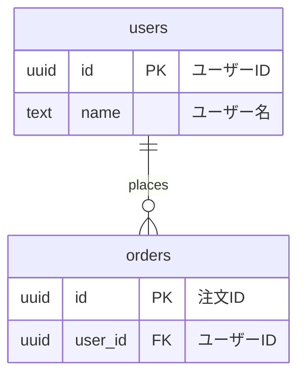

# ER図ドキュメント

カフェアプリケーションのデータベース構造を可視化したER図です。

## ファイル一覧

### 全体図
- **er_diagram_full.mmd** - 全28テーブルの関連を表示した完全版ER図

### 機能別ER図
- **er_diagram_user.mmd** - ユーザー・認証関連
  - ユーザープロフィール、メール設定、FCMトークン、カード情報など
  
- **er_diagram_product.mmd** - 商品・カテゴリ関連
  - 商品マスタ、カテゴリ、サイズ、温度タイプの関連
  
- **er_diagram_order.mmd** - 注文・カート関連
  - 注文、注文明細、カート、カート明細の関連
  
- **er_diagram_star.mmd** - スター・リワード関連
  - ポイント獲得、集計、使用、交換商品の関連
  
- **er_diagram_eticket.mmd** - eチケット関連
  - ユーザーチケット、プロモーション、特別オファー、スターリワード交換の関連
  
- **er_diagram_store.mmd** - 店舗・スタッフ関連
  - 店舗、スタッフ、シフトスケジュールの関連

## 使い方

### 1. オンラインビューアで表示

#### Mermaid Live Editor（推奨）
1. https://mermaid.live/ にアクセス
2. .mmdファイルの内容をコピー＆ペースト
3. リアルタイムでER図が表示されます
4. PNG/SVGでエクスポート可能

#### GitHub/GitLab
- リポジトリに.mmdファイルをプッシュすると自動的にレンダリングされます

### 2. VSCodeで表示

#### 拡張機能のインストール
```
Mermaid Preview
または
Markdown Preview Mermaid Support
```

#### 使い方
1. .mmdファイルを開く
2. プレビューを開く（Ctrl+Shift+V / Cmd+Shift+V）

### 3. MarkdownにER図を埋め込む

Markdownファイルに以下のように記述：

```markdown
## ER図

```mermaid
(ここに.mmdファイルの内容をコピー)
```
```

### 4. ドキュメント生成ツールで使用

- **Docusaurus**: Mermaidプラグインをインストール
- **VuePress**: @vuepress/plugin-mermaid を使用
- **MkDocs**: pymdown-extensions を使用

## テーブル定義の更新時

テーブル定義が変更された場合の更新手順：

### 1. 新しいテーブルの追加
```mermaid
新テーブル名 {
    型 カラム名 制約 "日本語名"
}
```

### 2. リレーションシップの追加
```mermaid
親テーブル ||--o{ 子テーブル : "関係性の説明"
```

### 3. カラムの追加・変更
テーブル定義ブロック内で該当カラムを追加・修正

### 4. リレーション記号の意味

| 記号 | 意味 |
|------|------|
| \|\|--\|\| | 1対1 |
| \|\|--o{ | 1対多 |
| }o--o{ | 多対多 |
| \|\|--o\| | 1対0または1 |

## 制約の使用方法とベストプラクティス

### サポートされている制約（@mermaid-js/mermaid-cli 11.12.0）

#### ✅ 使用可能な制約

| 制約 | 意味 | 使用例 |
|------|------|--------|
| `PK` | Primary Key（主キー） | `uuid id PK "ID"` |
| `FK` | Foreign Key（外部キー） | `uuid user_id FK "ユーザーID"` |
| `UK` | Unique Key（一意制約） | `text email UK "メールアドレス"` |

#### ❌ 使用不可の制約

| 制約 | 問題 | 代替方法 |
|------|------|----------|
| `PK_FK` | パースエラー発生 | `FK`を使用し、リレーションシップで表現 |
| `PK,FK` | サポートされていない | `FK`を使用し、リレーションシップで表現 |

### 正しい記述例

#### ✅ 良い例：主キーかつ外部キーのカラム



**ポイント**：
- 複合主キー＋外部キーの場合でも、制約は`FK`のみを記述
- 主キーの性質は、リレーションシップ（`users ||--o{ orders`）で表現

#### ❌ 悪い例：PK_FKを使用

```mermaid
erDiagram
    carts {
        uuid user_id PK_FK "ユーザーID"  ← エラー発生！
    }
```

**エラーメッセージ**：
```
Error: Parse error on line XX:
...uuid user_id PK_FK "ユーザーID"        ...
-----------------------^
Expecting 'ATTRIBUTE_WORD', got 'COMMENT'
```

### 新規ER図作成時のチェックリスト

新しいER図を作成する際は、以下を確認してください：

- [ ] 制約は`PK`、`FK`、`UK`のみを使用（複合制約は使用しない）
- [ ] 日本語コメントは二重引用符`"`で囲む
- [ ] リレーションシップで外部キー関係を明示
- [ ] SVG生成前にmmdファイルで`PK_FK`を検索し、残存していないか確認

### SVG生成前の確認コマンド

```bash
# プロジェクトルートから実行
cd supabase_schema/supabase/er

# PK_FKが残っていないか確認
grep -n "PK_FK" *.mmd

# 出力がなければOK（0件）
# 出力があれば、該当箇所をFKに修正
```

## カスタマイズ例

### テーマの変更
```mermaid
%%{init: {'theme':'forest'}}%%
erDiagram
...
```

利用可能なテーマ：
- default（デフォルト）
- forest（緑系）
- dark（ダーク）
- neutral（ニュートラル）

### 色のカスタマイズ
```mermaid
%%{init: {
  'theme': 'base',
  'themeVariables': {
    'primaryColor': '#BB2528',
    'primaryTextColor': '#fff',
    'primaryBorderColor': '#7C0000'
  }
}}%%
erDiagram
...
```

## エクスポート方法

### PNG/SVG形式
1. Mermaid Live Editorで開く
2. 右上の「Actions」→「Export」
3. PNG/SVG/PDF形式を選択

### PDF形式
1. VSCodeの拡張機能「Mermaid PDF」を使用
2. またはMermaid CLIツールでコマンドライン変換（[@mermaid-js/mermaid-cli](https://github.com/mermaid-js/mermaid-cli)）

```bash
npm install -g @mermaid-js/mermaid-cli
mmdc -i er_diagram_full.mmd -o er_diagram_full.pdf
```

### SVG一括生成（コマンドライン）

全てのER図を一度にSVG形式で生成する場合：

```bash
# プロジェクトルートから実行
cd supabase_schema/supabase/er

# 事前チェック：PK_FKが残っていないか確認
grep -n "PK_FK" er_diagram_*.mmd
# 出力があれば修正: sed -i 's/PK_FK/FK/g' er_diagram_*.mmd

# 全mmdファイルをSVGに変換
for file in er_diagram_*.mmd; do
    mmdc -i "$file" -o "${file%.mmd}.svg"
    echo "✓ ${file%.mmd}.svg 生成完了"
done

# 生成確認
ls -lh er_diagram_*.svg
```

**個別ファイルのSVG生成**：
```bash
# 特定のファイルのみ生成
mmdc -i er_diagram_user.mmd -o er_diagram_user.svg
```

## トラブルシューティング

### SVG生成時のパースエラー

#### エラー1: `Expecting 'ATTRIBUTE_WORD', got 'COMMENT'`

**症状**：
```
Error: Parse error on line XX:
...uuid user_id PK_FK "ユーザーID"        ...
-----------------------^
Expecting 'ATTRIBUTE_WORD', got 'COMMENT'
```

**原因**：
- `PK_FK`のような複合制約を使用している
- mermaid-cli 11.12.0では複合制約がサポートされていない

**解決方法**：
```bash
# 1. PK_FKが使用されている箇所を確認
grep -n "PK_FK" *.mmd

# 2. 全ファイルのPK_FKをFKに一括置換
sed -i 's/PK_FK/FK/g' er_diagram_*.mmd

# 3. 修正確認
grep -c "PK_FK" er_diagram_*.mmd

# 4. SVG再生成
mmdc -i er_diagram_xxx.mmd -o er_diagram_xxx.svg
```

#### エラー2: `Expecting 'ATTRIBUTE_WORD', got 'ATTRIBUTE_KEY'`

**症状**：
```
Error: Parse error on line XX:
...bpchar store_number FK        integer p
-----------------------^
Expecting 'ATTRIBUTE_WORD', got 'ATTRIBUTE_KEY'
```

**原因**：
- 同じファイル内に`PK_FK`が残存している
- 制約の記述が不正

**解決方法**：
```bash
# ファイル全体を確認
cat er_diagram_xxx.mmd | grep -E "(PK_FK|PK,FK)"

# 該当箇所を手動で修正、または一括置換
sed -i 's/PK_FK/FK/g' er_diagram_xxx.mmd
```

### 図が表示されない場合
- Mermaid記法にエラーがないか確認
- ブラウザのキャッシュをクリア
- 別のビューアで試す
- 制約記述を確認（`PK_FK`等の複合制約を使用していないか）

### 図が複雑すぎる場合
- 機能別ER図を使用
- 不要なテーブルをコメントアウト（%% コメント）

### パフォーマンスが遅い場合
- テーブル数を減らす
- 詳細なカラム情報を省略

### SVG生成がうまくいかない場合

#### デバッグ手順

1. **mermaid-cliのバージョン確認**
   ```bash
   mmdc --version
   # 推奨: 11.12.0以上
   ```

2. **最小構成でテスト**
   ```bash
   # テスト用の簡単なmmdファイルを作成
   echo 'erDiagram
       test_table {
           uuid id PK "ID"
           text name "名前"
       }
   ' > test.mmd

   # SVG生成テスト
   mmdc -i test.mmd -o test.svg
   ```

3. **エラーログの詳細確認**
   ```bash
   # 詳細ログ出力
   mmdc -i er_diagram_xxx.mmd -o er_diagram_xxx.svg --verbose
   ```

4. **構文検証**
   - [Mermaid Live Editor](https://mermaid.live/)で構文チェック
   - mmdファイルの内容をコピー＆ペースト
   - エラーがある場合は赤色で表示される

## リファレンス

- [Mermaid公式ドキュメント](https://mermaid.js.org/)
- [ER図記法ガイド](https://mermaid.js.org/syntax/entityRelationshipDiagram.html)
- [Mermaid Live Editor](https://mermaid.live/)

## 更新履歴

- 2026-02-15:
  - スタッフ・シフト管理テーブル追加
  - mermaid-cli 11.12.0対応のため`PK_FK`を`FK`に修正
  - 全7つのmmdファイルからSVGファイルを生成
  - ER_README.mdに以下を追加：
    - 制約の使用方法とベストプラクティス
    - SVG生成時のエラー対処法（トラブルシューティング）
    - SVG一括生成コマンド
- 2026-01-05: eチケット関連テーブル追加
- 2025-07-20: 初版作成

## 注意事項

### mermaid-cliバージョンについて
- 使用バージョン: @mermaid-js/mermaid-cli 11.12.0
- `PK_FK`のような複合制約はサポートされていないため、`FK`を使用しています
- 主キーと外部キーの両方の性質を持つカラムは、リレーションシップ（`||--o{`）で表現しています
