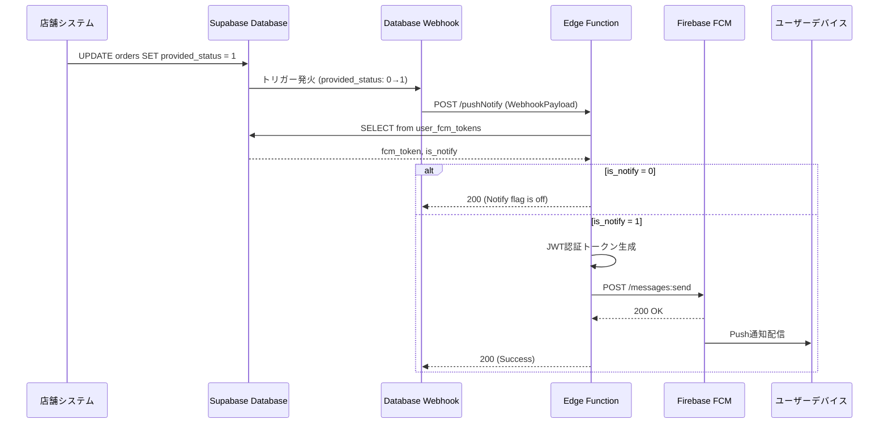
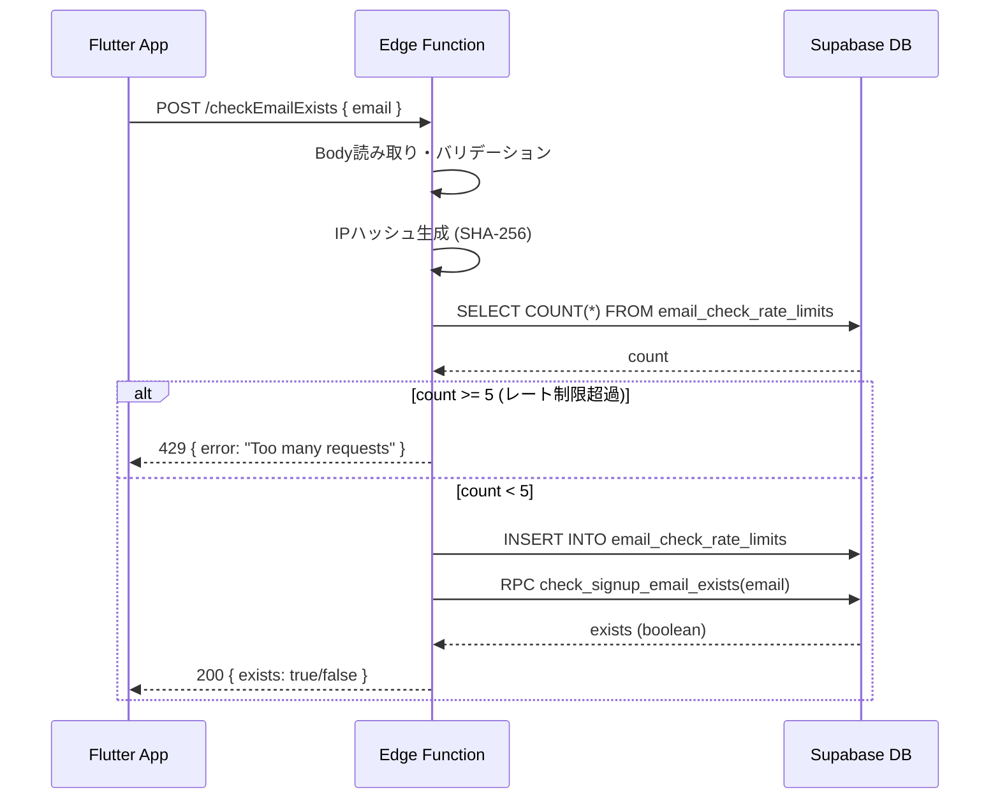

# Supabase Edge Functions 仕様書

**最終更新:** 2026-02-23

このディレクトリには、Supabase Edge Functionsとして実装されたサーバーサイドロジックが含まれています。

## 📋 目次

- [Push通知機能 (pushNotify)](#push通知機能-pushnotify)
  - [概要](#概要)
  - [アーキテクチャ](#アーキテクチャ)
  - [Database Webhooksの設定](#database-webhooksの設定)
  - [動作フロー](#動作フロー)
  - [使用テーブル](#使用テーブル)
  - [通知内容](#通知内容)
  - [エラーハンドリング](#エラーハンドリング)
  - [トラブルシューティング](#トラブルシューティング)
- [メール送信機能 (sendMailRegisterUser)](#メール送信機能-sendmailregisteruser)
- [メールアドレス重複チェック (checkEmailExists)](#メールアドレス重複チェック-checkemailexists)
  - [概要](#概要-1)
  - [アーキテクチャ](#アーキテクチャ-1)
  - [動作フロー](#動作フロー-1)
  - [レート制限](#レート制限)
  - [使用テーブル・RPC](#使用テーブルrpc)
  - [リクエスト・レスポンス仕様](#リクエストレスポンス仕様)
  - [エラーハンドリング](#エラーハンドリング-1)
  - [デプロイ](#デプロイ)

---

## Push通知機能 (pushNotify)

### 概要

商品受取準備完了時にユーザーのスマートフォンへPush通知を送信する機能です。

**主な用途:**
- 店舗での商品準備完了時の通知
- 受取番号の即時通知
- ユーザー体験の向上

**使用技術:**
- Supabase Database Webhooks
- Supabase Edge Functions (Deno runtime)
- Firebase Cloud Messaging (FCM)
- Google Auth Library for JWT認証

### アーキテクチャ

```
┌─────────────────┐
│  orders table   │  provided_status: 0 → 1
└────────┬────────┘
         │ UPDATE trigger
         │
         ▼
┌─────────────────────────┐
│ Database Webhook        │
└────────┬────────────────┘
         │ POST request
         │
         ▼
┌─────────────────────────┐
│ Edge Function           │
│ (pushNotify/index.ts)   │
└────────┬────────────────┘
         │
         ├─ 1. user_fcm_tokens からトークン取得
         │
         ├─ 2. is_notify フラグ確認
         │
         ├─ 3. Google JWT 認証
         │
         ▼
┌─────────────────────────┐
│ Firebase Cloud          │
│ Messaging (FCM)         │
└────────┬────────────────┘
         │
         ▼
┌─────────────────────────┐
│ ユーザーのデバイス      │
│ (Push通知表示)          │
└─────────────────────────┘
```

### Database Webhooksの設定

Supabaseダッシュボードから以下の手順で設定します:

1. **ダッシュボードへアクセス**
   - プロジェクトページを開く
   - 左メニューから「Database」→「Webhooks」を選択

2. **新規Webhook作成**
   - 「Create a new hook」をクリック
   - Hook nameを入力: `notify_order_ready`

3. **トリガー設定**
   - Table: `orders`
   - Events: `UPDATE` のみを選択
   - Conditions: 以下のSQLを入力

   ```sql
   old.provided_status = '0' AND new.provided_status = '1'
   ```

4. **関数指定**
   - HTTP Request: `POST`
   - HTTP URL: `https://<project-ref>.supabase.co/functions/v1/pushNotify`
   - HTTP Headers:
     ```
     Content-Type: application/json
     Authorization: Bearer <service_role_key>
     ```

5. **保存**
   - 「Create webhook」をクリック

### 動作フロー



**ステップ詳細:**

1. **トリガー発火条件**
   - `orders.provided_status` が `0` から `1` に更新された時のみ

2. **FCMトークン取得**
   ```typescript
   const { data } = await supabase
     .from('user_fcm_tokens')
     .select('fcm_token, is_notify')
     .eq('user_id', payload.record.user_id)
     .single()
   ```

3. **通知フラグ確認**
   - `is_notify = 0`: 通知OFF → 処理終了 (200レスポンス)
   - `is_notify = 1`: 通知ON → FCM送信へ進む

4. **JWT認証**
   - Google Service Accountを使用してアクセストークンを取得
   - スコープ: `https://www.googleapis.com/auth/firebase.messaging`

5. **FCMメッセージ送信**
   ```typescript
   {
     message: {
       token: fcmToken,
       notification: {
         title: `【受取番号:${pickup_number}】`,
         body: '商品のご用意ができました!お待ちしております'
       },
       data: {
         order_id: order_id
       }
     }
   }
   ```

### 使用テーブル

#### ordersテーブル

注文情報を管理するテーブル。

| カラム名 | 型 | 説明 |
|----------|-----|------|
| id | uuid | 主キー |
| user_id | uuid | ユーザーID (外部キー) |
| order_id | text | 注文ID |
| pickup_number | text | 受取番号 (通知タイトルに表示) |
| provided_status | text | 提供状態 ('0': 準備中, '1': 準備完了) |
| created_at | timestamp | 作成日時 |
| updated_at | timestamp | 更新日時 |
| store_number | text | 店舗番号 |
| order_type | integer | 注文タイプ |
| usage | integer | 利用区分 |
| payment_method | text | 支払い方法 |
| price_with_tax | numeric | 税込価格 |
| price_without_tax | numeric | 税抜価格 |

**トリガー条件:**
```sql
provided_status: '0' → '1'
```

#### user_fcm_tokensテーブル

ユーザーのFCMトークンと通知設定を管理するテーブル。

| カラム名 | 型 | 説明 |
|----------|-----|------|
| user_id | uuid | ユーザーID (主キー・外部キー) |
| fcm_token | text | Firebase Cloud Messagingトークン |
| is_notify | integer | 通知ON/OFF (0: OFF, 1: ON) |
| created_at | timestamp | 作成日時 |
| updated_at | timestamp | 更新日時 |

**is_notifyフラグ:**
- `0`: 通知OFF（ユーザーが通知を無効化）
- `1`: 通知ON（通知を送信）

### 通知内容

#### 通知タイトル
```
【受取番号:{pickup_number}】
```

例: `【受取番号:A-001】`

#### 通知本文
```
商品のご用意ができました!お待ちしております
```

#### データペイロード
```json
{
  "order_id": "order_20240101_123456"
}
```

アプリ側で注文詳細画面への遷移などに使用可能。

### エラーハンドリング

#### 1. FCMトークンが存在しない

**条件:**
```typescript
if (data == null)
```

**レスポンス:**
```
Status: 404 Not Found
Body: "No data found"
```

**ログ出力:**
```typescript
console.warn('fcm_token is null');
```

**原因:**
- ユーザーがアプリを一度もインストールしていない
- FCMトークン登録処理が未完了
- user_fcm_tokensテーブルにレコードが存在しない

**対処:**
- アプリ側でFCMトークン登録処理を実行
- 初回起動時に自動登録する仕組みを確認

#### 2. 通知フラグがOFF

**条件:**
```typescript
if (isNotify == 0)
```

**レスポンス:**
```
Status: 200 OK
Body: "Notify flag is off"
```

**動作:**
- 通知は送信されない
- 正常終了として扱われる

**原因:**
- ユーザーがアプリ内設定で通知をOFFにしている

#### 3. FCM送信エラー

**条件:**
```typescript
if (res.status < 200 || 299 < res.status)
```

**動作:**
```typescript
throw resData
```

**原因:**
- 無効なFCMトークン（トークン期限切れ、アプリ再インストール）
- Firebase側のエラー
- ネットワークエラー

**対処:**
- FCMエラーレスポンスを確認
- トークンが無効な場合は、アプリ側で再取得・再登録

#### 4. 条件不一致

**条件:**
```typescript
// provided_status が 0→1 以外の更新
if (!(payload.old_record.provided_status == '0' && payload.record.provided_status == '1'))
```

**レスポンス:**
```
Status: 200 OK
Body: {}
```

**動作:**
- 何もせずに正常終了

### トラブルシューティング

#### 通知が届かない場合のチェックリスト

1. **Database Webhookの動作確認**
   ```sql
   -- Webhookログを確認（Supabaseダッシュボード > Database > Webhooks）
   -- 実行履歴、ステータスコード、エラーメッセージを確認
   ```

2. **FCMトークンの存在確認**
   ```sql
   SELECT * FROM user_fcm_tokens WHERE user_id = '<user_id>';
   ```
   - `fcm_token`が存在するか
   - `is_notify = 1`になっているか

3. **Edge Functionのログ確認**
   - Supabaseダッシュボード > Edge Functions > pushNotify
   - ログで以下を確認:
     - `fcm_token is null` が出ていないか
     - `Notify flag is off` が出ていないか
     - FCMのエラーレスポンス

4. **provided_statusの更新確認**
   ```sql
   -- ordersテーブルの更新履歴を確認
   SELECT user_id, order_id, provided_status, updated_at
   FROM orders
   WHERE user_id = '<user_id>'
   ORDER BY updated_at DESC
   LIMIT 5;
   ```
   - `provided_status`が`0`→`1`に正しく更新されているか

5. **FCMトークンの有効性確認**
   - Firebase Console > Cloud Messaging
   - テストメッセージ送信で有効性を確認

#### よくあるエラーと対処法

| エラーメッセージ | 原因 | 対処法 |
|------------------|------|--------|
| `No data found` | FCMトークンが登録されていない | アプリ側でFCMトークン登録処理を実行 |
| `Notify flag is off` | ユーザーが通知をOFF | 正常動作（通知しない） |
| `Invalid registration token` | FCMトークンが無効 | アプリ再起動時にトークン再取得・再登録 |
| `Authentication error` | JWT認証失敗 | service-account.jsonの設定確認 |
| Webhook not triggered | 条件不一致またはWebhook設定ミス | Webhook条件式とDatabase設定を確認 |

#### デバッグ手順

1. **手動でWebhookをトリガー**
   Integgrations > Database Webhooks
   ```sql
   UPDATE orders
   SET provided_status = '1'
   WHERE order_id = '<test_order_id>' AND provided_status = '0';
   ```

2. **Edge Functionを直接呼び出し**
   ```bash
   curl -X POST https://<project-ref>.supabase.co/functions/v1/pushNotify \
     -H "Authorization: Bearer <service_role_key>" \
     -H "Content-Type: application/json" \
     -d '{
       "type": "UPDATE",
       "table": "orders",
       "record": {
         "user_id": "<user_id>",
         "order_id": "<order_id>",
         "pickup_number": "A-001",
         "provided_status": "1"
       },
       "old_record": {
         "provided_status": "0"
       }
     }'
   ```

3. **FCMに直接メッセージ送信**
   - Firebase Console > Cloud Messaging > Send test message
   - FCMトークンを入力してテスト送信

---

## メール送信機能 (sendMailRegisterUser)

**現在準備中**

ユーザー登録時の確認メール送信機能の仕様を記載予定。

---

## メールアドレス重複チェック (checkEmailExists)

### 概要

仮会員登録フォームで入力されたメールアドレスが既に登録済みかどうかをチェックする機能です。

**主な用途:**
- 仮会員登録画面（`pre_signup.dart`）からの呼び出し
- `pre_signup_users` テーブルおよび `auth.users` の両方を対象に重複確認
- IPベースのレート制限で連続送信を防止

**認証方式:**
- `--no-verify-jwt` でデプロイ（JWT なしで呼び出し可能）
- Flutter 側から `supabase.functions.invoke('checkEmailExists', ...)` で直接呼び出す

### アーキテクチャ

```
┌─────────────────────────────────┐
│  Flutter (pre_signup.dart)      │
│  supabase.functions.invoke(     │
│    'checkEmailExists',          │
│    body: { email: '...' }       │
│  )                              │
└────────────────┬────────────────┘
                 │ POST (no JWT)
                 ▼
┌─────────────────────────────────┐
│ Edge Function                   │
│ (checkEmailExists/index.ts)     │
└────────────────┬────────────────┘
                 │
                 ├─ 1. Body読み取り (email バリデーション)
                 │
                 ├─ 2. IPハッシュ生成 (SHA-256)
                 │
                 ├─ 3. レート制限チェック
                 │      email_check_rate_limits テーブル
                 │
                 ├─ 4. リクエスト記録 (rate_limits INSERT)
                 │
                 ├─ 5. 古いレコード削除 (best effort)
                 │
                 └─ 6. RPC呼び出し
                        check_signup_email_exists(input_email)
                              │
                              ▼
                    { exists: boolean }
```

### 動作フロー



### レート制限

同一IPアドレスからの過剰なリクエストを防ぐためにレート制限を設けています。

| 項目 | 値 |
|------|-----|
| 最大リクエスト数 | 5回 |
| ウィンドウ幅 | 5分 |
| キー | IPアドレスの SHA-256 ハッシュ |
| 超過時のレスポンス | 429 Too Many Requests |
| クリーンアップ | 24時間経過レコードを best-effort で削除 |

IPアドレスは `x-forwarded-for` ヘッダーから取得し、SHA-256 でハッシュ化して保存（プライバシー保護）。

### 使用テーブル・RPC

#### email_check_rate_limits テーブル

レート制限のリクエスト履歴を管理するテーブル。

| カラム名 | 型 | 説明 |
|----------|-----|------|
| id | uuid | 主キー (自動生成) |
| ip_hash | text | IPアドレスの SHA-256 ハッシュ |
| created_at | timestamptz | リクエスト日時 |

#### check_signup_email_exists RPC

メールアドレスの重複を判定する PostgreSQL 関数。

```sql
-- 呼び出し例
SELECT check_signup_email_exists('user@example.com');
-- 戻り値: boolean (true = 登録済み)
```

`pre_signup_users` テーブルおよび `auth.users` を対象に重複確認。
詳細は `supabase_schema/supabase/migrations/` 内の対応マイグレーションを参照。

### リクエスト・レスポンス仕様

#### リクエスト

```
POST /functions/v1/checkEmailExists
Content-Type: application/json
```

```json
{
  "email": "user@example.com"
}
```

#### レスポンス一覧

| ステータス | ボディ | 説明 |
|-----------|--------|------|
| 200 | `{ "exists": false }` | 未登録メール（登録可能） |
| 200 | `{ "exists": true }` | 登録済みメール |
| 400 | `{ "error": "Invalid request" }` | `email` パラメータ不正 |
| 405 | `Method not allowed` | POST 以外のメソッド |
| 429 | `{ "error": "Too many requests" }` | レート制限超過 |
| 500 | `{ "error": "Internal server error" }` | RPC 実行エラー |

### エラーハンドリング

#### Flutter 側 (`pre_signup.dart`)

| 戻り値 | 意味 | Flutter の動作 |
|--------|------|----------------|
| `true` | ユニーク（未登録） | メール送信 → 完了画面へ遷移 |
| `false` | 登録済み | 「既に登録されています」ダイアログ表示 |
| `null` | サーバーエラー / レート制限 | 「しばらく時間をおいて…」ダイアログ表示 |

`response.data` が `Map<String, dynamic>` 以外（`String` 等）で返った場合も
`jsonDecode` でフォールバック処理し、型エラーによる誤判定を防いでいる。

### デプロイ

```bash
# JWT検証なしでデプロイ（Flutter から匿名呼び出しのため）
supabase functions deploy checkEmailExists --no-verify-jwt

# デプロイ確認
supabase functions list
```

#### ログ確認

Supabase Dashboard > Edge Functions > checkEmailExists > **Logs** タブで以下を確認:

```
[checkEmailExists] called with email: xxx@xxx.com
[checkEmailExists] result: exists = false
```

エラー発生時:
```
[checkEmailExists] Invalid request body: ...
[checkEmailExists] Rate limit table error (continuing): ...
[checkEmailExists] Rate limit exceeded for ip_hash: xxxxxxxx
[checkEmailExists] RPC error: ...
```

---

## 開発環境

### 必要な環境変数

```bash
SUPABASE_URL=https://<project-ref>.supabase.co
SUPABASE_SERVICE_ROLE_KEY=<service_role_key>
```

### ローカルでの実行

```bash
# Supabase CLIのインストール
npm install -g supabase

# ローカルでEdge Functionを実行
supabase functions serve pushNotify

# 別のターミナルでテストリクエスト
curl -i --location --request POST 'http://localhost:54321/functions/v1/pushNotify' \
  --header 'Authorization: Bearer <anon_key>' \
  --header 'Content-Type: application/json' \
  --data '{"type":"UPDATE","table":"orders","record":{"user_id":"<uuid>","order_id":"test","pickup_number":"A-001","provided_status":"1"},"old_record":{"provided_status":"0"}}'
```

### デプロイ

```bash
# 本番環境へのデプロイ
supabase functions deploy pushNotify

# デプロイ確認
supabase functions list
```

---

## 参考資料

- [Supabase Edge Functions](https://supabase.com/docs/guides/functions)
- [Supabase Database Webhooks](https://supabase.com/docs/guides/database/webhooks)
- [Firebase Cloud Messaging](https://firebase.google.com/docs/cloud-messaging)
- [Supabase Functions - Push Notifications Example](https://supabase.com/docs/guides/functions/examples/push-notifications?queryGroups=platform&platform=fcm)

---